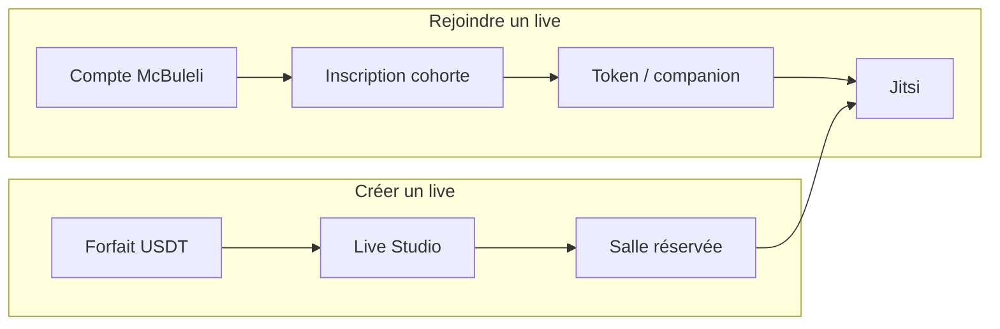

# Live `live.mcbuleli.org` — accès contrôlé



| Rôle | Condition | Coût |
|------|-----------|------|
| **Participant** | Compte + inscrit à l’édition | Gratuit |
| **Animateur** | Staff McBuleli, co-host, ou **Live Studio** payé | 3–28 USDT |

## App

- **Rejoindre** : `/app/academy/…/live/…` → API `GET /api/academy/live/join-token` (session cookie).
- **Héberger** : `/app/academy/studio` → achat wallet → création édition `live_studio`.

## VPS (recommandé)

1. `enableWelcomePage: false` (déjà dans `ops/jitsi/`)
2. **JWT** : voir `ops/jitsi/jwt-setup.md` + variables Render :

```env
JITSI_APP_ID=mcbuleli_live
JITSI_JWT_SECRET=<secret 32+ chars>
JITSI_JWT_SUB=live.mcbuleli.org
```

Sans JWT, l’app bloque déjà les liens directs ; le VPS reste ouvert si quelqu’un devine l’URL de salle.

## Migration

`drizzle/0063_academy_live_purchases.sql` — table `academy_live_purchases`, colonnes `owner_user_id` / `source` sur `academy_editions`.
