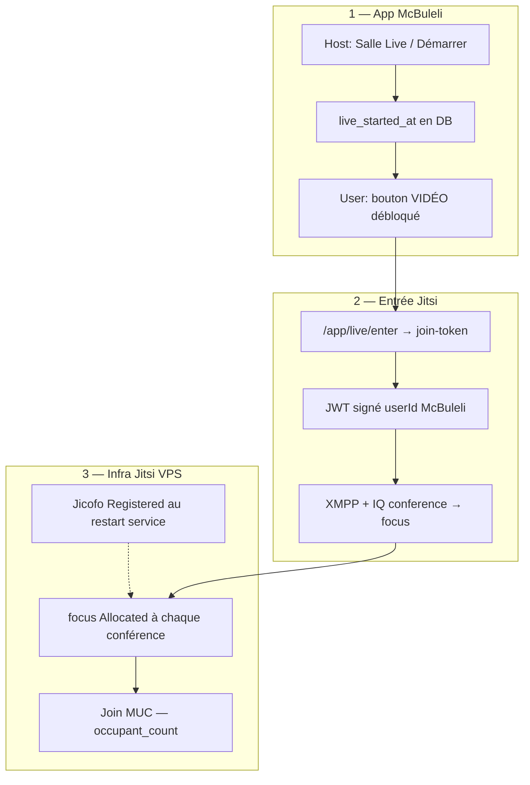

# Academy Live — cycle de vie et ordre des couches

Document de référence pour ne plus mélanger **app McBuleli**, **JWT**, **Jicofo** et **MUC**.

## Les trois couches



| Couche | Déclencheur | Stockage / log | Test valide |
|--------|-------------|----------------|-------------|
| **1 App** | Host entre en mode `host` (1ᵉʳ fois) | `academy_sessions.live_started_at` | USER voit VIDÉO après host |
| **2 Client** | Clic VIDÉO → JWT → navigateur Jitsi | URL `?jwt=`, logs Prosody auth | IQ focus `type=result` |
| **3 Serveur** | IQ conference acceptée par Jicofo | `jicofo.log` Allocated, MUC | `occupant_count ≥ 2` |

**`Jicofo Registered`** = couche 3 au **démarrage du service**, pas au clic « Salle Live ».

---

## Flux produit (host + user)

### Première ouverture d’une session (rituel complet)

1. Host et users ouvrent le **companion** `/app/academy/…/live/…`
2. `live_started_at` est `null` → user voit **« En attente du HOST »**, pas de bouton VIDÉO
3. Host clique **« Démarrer le live »** ou **« Salle animateur »** → `/app/live/enter?mode=host`
4. API `join-token` appelle `markLiveSessionStartedByHost()` → **`live_started_at` écrit une seule fois**
5. Companion user (poll 5 s) affiche le bouton **VIDÉO**
6. Compte à rebours / badge **LIVE** = créneau horaire (`startsAt` / `endsAt`), pas l’alloc Jicofo

### Ouvertures suivantes (même session d’édition)

- `live_started_at` **reste** en DB — pas de reset automatique aujourd’hui
- Plus de rituel d’attente — entrée directe
- Host garde deux boutons (VIDÉO + Salle animateur) : **redondance UX**, pas un second « start » DB

---

## Sécurité — prod vs debug

| Flux | Auth McBuleli | JWT | Quand l’utiliser |
|------|---------------|-----|------------------|
| **Production** | Session cookie + inscription + gate host | `userId` réel, signé par Render | Tests host/user réels |
| **Ops VPS** | Aucune | `test-host`, moderator (script VPS) | Isoler bug Prosody/Jicofo |

**Règle** : un test **Chrome privé + `gen-live-join-url.sh`** ne valide **pas** le modèle sécurité McBuleli. Il valide seulement que Prosody accepte un JWT valide.

Prod :

```
Compte McBuleli → companion → VIDÉO → /app/live/enter → join-token → live.mcbuleli.org?jwt=
```

Ne pas utiliser en prod : `https://live.mcbuleli.org/<room>?jwt=` collé à la main sans passer par l’app (sauf ops).

---

## JWT — émission et expiration

| Source | TTL par défaut | Nouveau token |
|--------|----------------|---------------|
| App `signAcademyJitsiToken` | **12 h** (`ttlSec` optionnel) | **Chaque** appel `GET /api/academy/live/join-token` |
| Ops `gen-live-join-url.sh` | **4 h** (`TEST_JWT_EXP_SECS`) | Chaque exécution du script |

- Pas de **révocation** : un JWT émis reste valide jusqu’à `exp`
- Fermer le companion **ne ferme pas** l’onglet Jitsi (`window.open` `_blank`)

---

## État actuel — gaps produit connus

| Gap | Comportement actuel | Piste future |
|-----|---------------------|--------------|
| Pas de **« Terminer le live »** | `live_started_at` permanent | API `endLive` + reset ou flag `live_ended_at` |
| Pas de **quitter Jitsi** propre | Onglet Jitsi orphelin, c2s fantômes | `beforeunload` + lien hangup ou iframe contrôlée |
| JWT long (12 h) | URL copiée réutilisable | `JITSI_JWT_TTL_SEC` court (ex. 15–30 min) |
| Deux boutons host | Confusion « encore Lancer » | Un seul CTA host après `live_started_at` |

---

## Blocage infra en cours (hors app)

Symptôme : auth XMPP OK, IQ conference → **`service-unavailable`**, pas d'`Allocated`, `occupant_count=0`.

Cause probable : `mod_client_proxy` sans session routable (presence focus → composant) malgré `focus@auth` visible dans `c2s`.

Playbook ops : `ops/jitsi/LIVE-PLAYBOOK.md`

---

## Fichiers code clés

| Fichier | Rôle |
|---------|------|
| `src/lib/academy-live-session.ts` | `live_started_at`, gate « waiting host » |
| `src/lib/academy-live-join.ts` | `join-token`, JWT, `markLiveSessionStartedByHost` |
| `src/hooks/use-academy-live-join-urls.ts` | Fetch JWT host/learner/audio |
| `src/lib/academy-jitsi-token.ts` | Signature JWT Prosody |
| `src/app/app/live/enter/page.tsx` | Redirect signé vers Jitsi |
| `src/components/academy/academy-open-classroom-bar.tsx` | Boutons VIDÉO / Salle animateur |

---

## Checklist test **produit** (après fix infra)

1. Deux **comptes McBuleli** (host + learner), même édition inscrite
2. Host : companion → **Démarrer le live** (1ᵉʳ fois si session neuve)
3. User : companion → attendre VIDÉO → cliquer VIDÉO
4. VPS : `sudo bash ops/jitsi/check-muc-live.sh <room-slug>` → `occupant_count=2`
5. Fermer **tous** les onglets `live.mcbuleli.org` entre les tests

Voir aussi : [academy-live-access.md](./academy-live-access.md), [ops/jitsi/LIVE-PLAYBOOK.md](../ops/jitsi/LIVE-PLAYBOOK.md)
