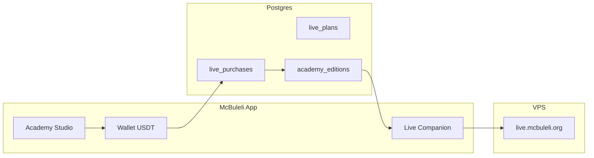

# Academy Live — branding Jitsi & produit payant (vision réaliste)

## 1. Deux couches de « McBuleli » sur le live

| Couche | Où | Statut |
|--------|-----|--------|
| **Companion app** | `/app/academy/…/live/…` | ✅ Branding hash Jitsi + UI verte + embed |
| **Serveur Jitsi** | `https://live.mcbuleli.org` | ⏳ À appliquer sur le VPS (`ops/jitsi/`) |

Sans la couche serveur, un visiteur qui ouvre **directement** `live.mcbuleli.org` voit encore l’accueil Jitsi générique. Les apprenants qui passent par l’app ont déjà l’expérience McBuleli (sujet, toolbar, qualité, cadre embed).

---

## 2. Personnalisation VPS (action immédiate)

Guide pas-à-pas : **`ops/jitsi/README.md`**

Contenu typique :
- Titre « McBuleli Academy Live »
- Langue FR par défaut
- Masquer promo mobile / watermark Jitsi
- Couleurs vert `#305f33`
- Désactiver la page d’accueil « créer une réunion » publique (recommandé avant monétisation)

Temps ops : **30–60 min** sur le VPS, sans changement Render.

---

## 3. Produit visé : « louer la salle McBuleli »

**Idée** : toute personne avec une communauté paie en **USDT** (wallet McBuleli) pour obtenir le droit d’utiliser **notre** Jitsi + companion (chat, présence, replays) pendant un créneau ou un mois.

**Ce que McBuleli vend** (pas juste un lien Jitsi) :
- Salle sur `live.mcbuleli.org` réservée à son programme
- Interface companion (check-in, phases setup/main, tuteur IA optionnel)
- Liste d’invités / cohorte (emails, invites)
- Replay R2 après coup (option plan supérieur)
- Support infra (vous payez le VPS avec les revenus)

**Ce que l’organisateur fait** :
- Choisit un **plan** (durée + nb participants max)
- Paie depuis son wallet
- Crée un **programme live** (titre, date, slug)
- Invite sa communauté (lien app ou salle directe selon plan)

---

## 4. Trois plans proposés (abordables, couvrent le serveur)

Hypothèse serveur : VPS ~**20–40 USD/mois**, capacité réaliste **~40–60 participants vidéo simultanés** sur un seul JVB (au-delà : upgrade VPS ou 2e bridge).

| Plan | Prix indicatif (USDT) | Durée max / live | Participants max | Sessions / mois | Cible |
|------|----------------------|------------------|------------------|-----------------|--------|
| **Starter** | **3 USDT** / événement | 90 min | 15 | 1 | Petit groupe, one-shot |
| **Community** | **12 USDT** / mois | 120 min | 35 | 4 | Formateur régulier |
| **Campus** | **28 USDT** / mois | 180 min | 60* | 8 | Cohorte large (*plafond technique serveur) |

Prix **volontairement bas** pour adoption ; ajuster après 2–3 mois de métriques (coût VPS / nombre de lives / heures JVB).

Répartition revenus (ordre de grandeur) :
- 10 Community + 2 Campus ≈ **176 USDT/mois** → couvre VPS + marge légère
- Volume faible au début → **subventionner** via Academy McBuleli officielle (vous utilisez déjà le serveur)

---

## 5. Ce qui est **réaliste** avec le code actuel

### Déjà en place ✅
- Wallet USDT + ledger (`bot_subscription`, `enrollInEdition`, P2P boost = **même pattern**)
- `academy_editions` + `academy_sessions` + `live_base_url`
- Co-animateurs (`academy_edition_hosts`)
- Admin centre de contrôle (`/admin/academy`)
- Liens live host / learner / branding hash

### Phase A — **2–3 semaines** (MVP payant manuel)
- Table `academy_live_plans` + `academy_live_purchases` (plan, expires_at, max_participants, minutes_included)
- API `POST /api/academy/live/purchase` → débit wallet + crée édition **draft** liée à l’acheteur
- UI `/app/academy/studio` : choisir plan → payer → formulaire (titre, date, slug) → lien invite
- **Staff valide** ou cron active l’édition (`status: open`)
- Pas de JWT Jitsi : salles en slug secret long + réservation dans la DB
- **Limite participants** : honor system + admin monitor (pas de mur technique fort)

### Phase B — **1–2 mois** (sécurité + limites)
- **Jitsi JWT** (`jitsi-meet` token auth) : seuls les utilisateurs McBuleli connectés obtiennent un token modérateur / guest
- Vérification « nombre dans la room » via API Jitsi ou compteur présence `academy_attendance`
- Blocage auto à la fin du créneau (message + lien coupé côté app)
- Page `live.mcbuleli.org` : **pas de création libre** (welcome page off)

### Phase C — **plus tard** (scale)
- Multi-tenant : plusieurs VPS ou JVB pool si >60 simultanés
- Replays inclus par plan (upload R2 automatisé)
- Certificat / badge Open Badge pour participants
- Facturation à la minute au-delà du forfait

---

## 6. Ce qui est **peu réaliste** à court terme

| Idée | Pourquoi |
|------|----------|
| Chacun crée une salle **sans payer** sur live.mcbuleli.org | Abus, coût VPS, spam ; il faut JWT + paiement avant room |
| Illimité participants / durée sur un seul VPS 2 vCPU | Crash JVB, mauvaise UX |
| Paiement uniquement côté Jitsi (hors McBuleli) | Pas de lien wallet / cohorte / analytics |
| Remplacer toute l’UI Jitsi par une WebRTC maison | Mois de dev ; garder Jitsi + companion |
| Modération IA temps réel | Hors scope ; modération humaine + signalement d’abord |

---

## 7. Architecture cible (schéma)

---

## 8. Recommandation produit

1. **Maintenant** : branding VPS (`ops/jitsi`) + tests live Academy officiels sur le serveur payé par McBuleli.
2. **Ensuite** : **Phase A** — 3 plans en config (`src/lib/academy-live-plans.ts`), paiement USDT, édition créée par l’utilisateur « communauté », vous gardez super_admin pour modération.
3. **Ne pas** ouvrir la création de réunion publique sur Jitsi avant paiement + JWT (sinon n’importe qui utilise votre VPS).

---

## 9. Lien avec Academy actuelle

- **Cohortes McBuleli** (juin 2026, Pro…) = éditions **internes** (`super_admin` / staff).
- **Live Studio** = même tables `academy_editions` / `sessions`, avec `owner_user_id` + `source: 'live_studio'` et achat plan obligatoire.
- Un formateur externe n’a pas besoin d’un nouveau produit séparé : c’est **Academy en mode hôte payant**.

Voir aussi : `docs/academy-infra.md`, `docs/academy-vision.md`.
