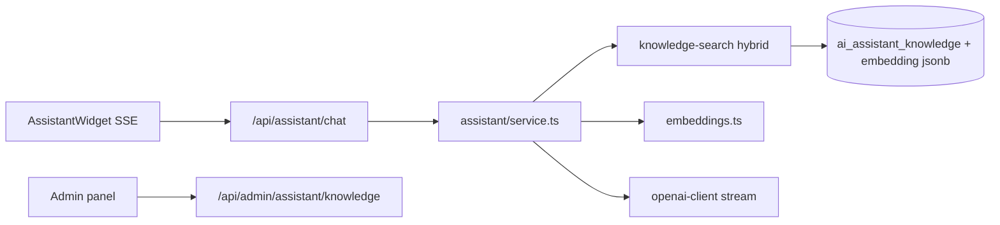

# McBuleli AI Virtual Assistant

Production-ready floating AI concierge integrated across mcbuleli.org.

## Scope & safety (guest + logged-in)

McBuleli AI is a **product assistant**, not a general ChatGPT.

- Shared system prompt: McBuleli-only topics (wallet, P2P, trading, Academy, KYC…).
- Hard refuse: politics / elections / conflict news / homework & unrelated creative asks (`scope-guard.ts`) — same for homepage guests and signed-in users.
- Knowledge seed is **upserted** on boot so fees/limits stay aligned with `withdraw-fees.ts`.

Academy syllabus mentor (`academy-mentor-context`) remains for enrolled learners and is even narrower.

## Architecture



## Features (v2)

| Feature | Status |
|---------|--------|
| SSE streaming replies | ✅ `stream: true` on chat API |
| Semantic RAG | ✅ OpenAI `text-embedding-3-small` + cosine similarity |
| Keyword fallback | ✅ When no API key or no embeddings |
| Auto-embed on seed | ✅ Background backfill |
| Admin embed button | ✅ `GET ?embed=1` |

## Environment variables

| Variable | Required | Description |
|----------|----------|-------------|
| `OPENAI_API_KEY` | Recommended | GPT + embeddings |
| `OPENAI_ASSISTANT_MODEL` | Optional | Default `gpt-4o-mini` |
| `OPENAI_EMBEDDING_MODEL` | Optional | Default `text-embedding-3-small` |
| `DATABASE_URL` | Yes | Postgres (Neon) |

## Database migration

**Required** — apply migration `0051_ai_assistant` (registered in Drizzle journal):

```bash
npm run db:migrate:render
```

If chat returns HTTP 503 / `assistant_db_not_migrated`, the tables are missing — run the command above.

After deploy with `OPENAI_API_KEY`, open **Admin → AI Assistant → Generate embeddings** once to vectorize the FAQ.

Tables: `ai_assistant_conversations`, `ai_assistant_messages`, `ai_assistant_knowledge`.

## API

### POST `/api/assistant/chat`

```json
{
  "message": "How do I deposit USDT?",
  "conversationId": "uuid-optional",
  "guestToken": "optional",
  "locale": "fr",
  "pageContext": "deposit",
  "stream": true
}
```

With `stream: true`, response is `text/event-stream`:

- `{ type: "meta", conversation, guestToken }`
- `{ type: "token", content: "..." }` (repeated)
- `{ type: "done", userMessage, assistantMessage, recommendations }`

## Admin

Super-admin: `/admin/assistant` — FAQ CRUD, analytics, embedding backfill.

## Security

- System prompt blocks password/seed phrase requests
- Guest conversations isolated by `guestToken`
- Rate limit: 40 user messages / hour / conversation
- Admin API: super-admin only

## Roadmap

- pgvector index for large knowledge bases
- Voice input (Web Speech API)
- Human handoff thread linking
