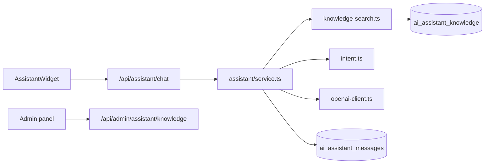

# McBuleli AI Virtual Assistant

Production-ready floating AI concierge integrated across mcbuleli.org.

## Architecture



## Folder structure

```
src/
  components/assistant/
    assistant-launcher.tsx
    assistant-widget.tsx
    assistant-avatar.tsx
    assistant-message.tsx
  lib/assistant/
    messages.ts
    system-prompt.ts
    intent.ts
    page-context.ts
    knowledge-seed.ts
    knowledge-search.ts
    openai-client.ts
    service.ts
  app/api/assistant/
    chat/route.ts
    conversation/route.ts
  app/api/admin/assistant/knowledge/route.ts
  app/admin/assistant/page.tsx
drizzle/0051_ai_assistant.sql
```

## Environment variables

| Variable | Required | Description |
|----------|----------|-------------|
| `OPENAI_API_KEY` | Recommended | Enables GPT responses |
| `OPENAI_ASSISTANT_MODEL` | Optional | Default `gpt-4o-mini` |
| `DATABASE_URL` | Yes | Postgres (Neon) |

Without `OPENAI_API_KEY`, the assistant uses built-in rule-based replies.

## Database migration

```bash
npm run db:migrate:render
```

Tables: `ai_assistant_conversations`, `ai_assistant_messages`, `ai_assistant_knowledge`.

## Admin

Super-admin: `/admin/assistant` — FAQ CRUD + 7-day analytics.

## Security

- System prompt blocks password/seed phrase requests
- Guest conversations isolated by `guestToken`
- Rate limit: 40 user messages / hour / conversation
- Admin API: super-admin only
