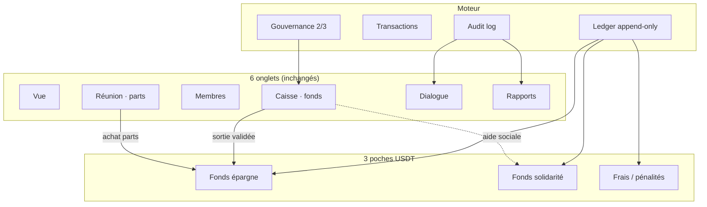
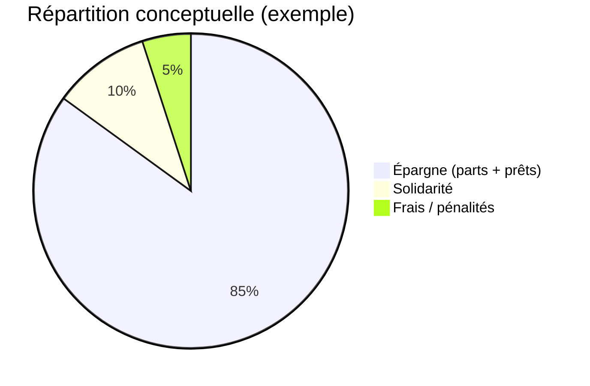
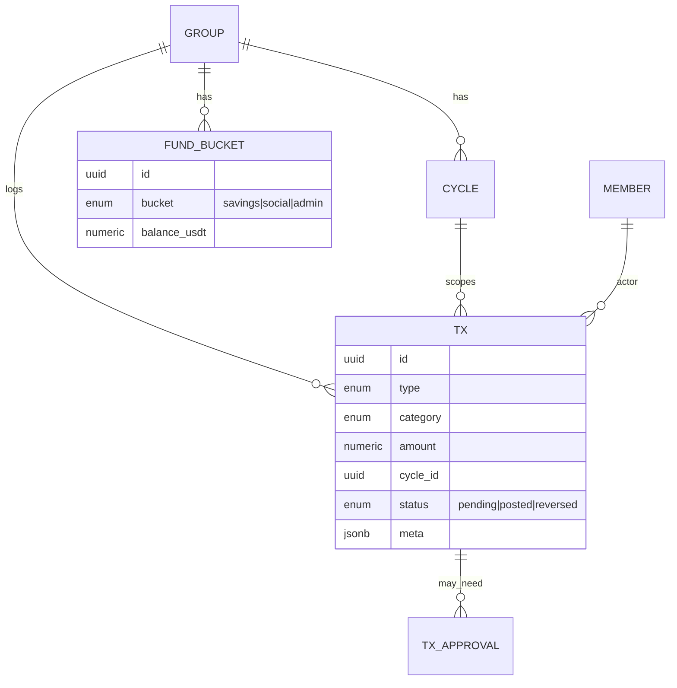
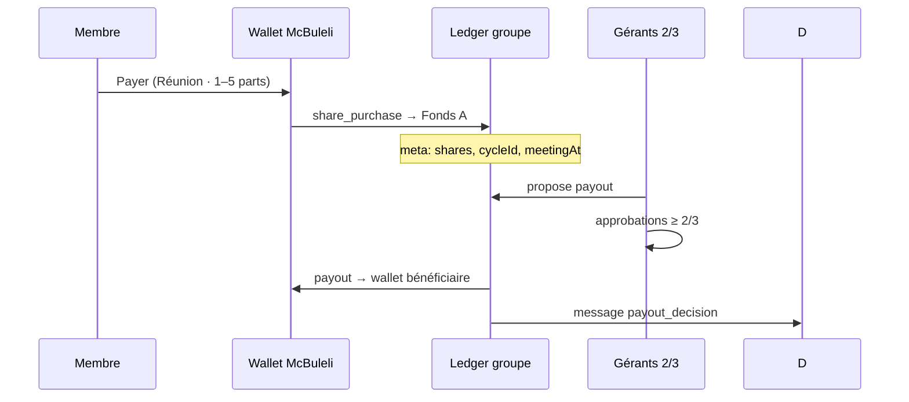
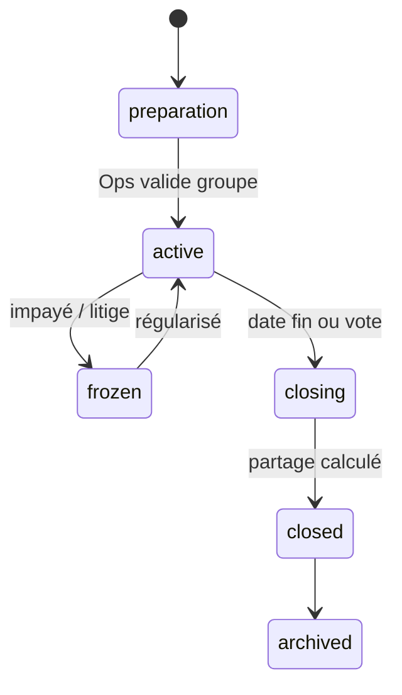
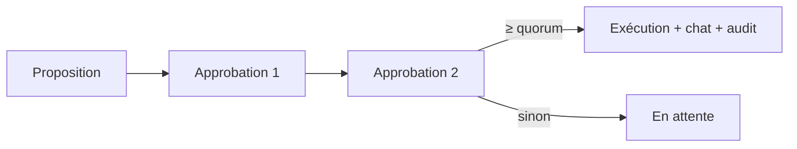
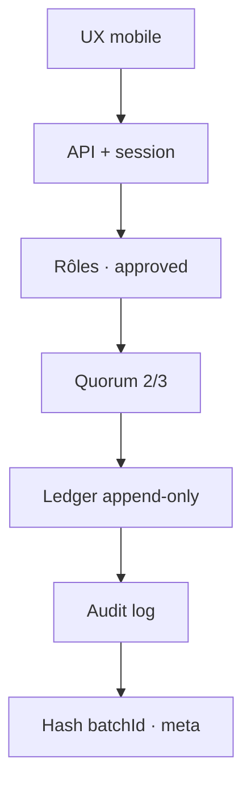
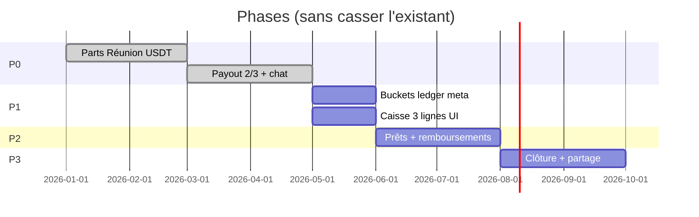

# Architecture des fonds AVEC — McBuleli

> **Principe** : enrichir sans casser. Parts 1–5 · cycle · USDT · 6 onglets · journal · audit · paiements 2/3 restent la base.

---

## 1. Carte d’ensemble



| Aujourd’hui (prod) | Cible phase 1 | Cible phase 2+ |
|--------------------|---------------|----------------|
| 1 caisse USDT | 3 poches comptables | + prêts + clôture auto |
| `group_contribution_in/out` | + catégories ledger | + cycles table |
| Parts → meta ledger | % propriété fonds | moteur partage final |
| Payout 2/3 managers | idem + prêts quorum | votes / auditeur |

---

## 2. Les 3 fonds (séparation comptable)



| Fonds | Rôle | Règle clé | Prêts ? |
|-------|------|-----------|---------|
| **A · Épargne** | Parts, capital, liquidité prêts | 1 part = `contributionAmountUsdt` / cycle | Oui |
| **B · Solidarité** | Urgences, décès, maladie | `socialFundUsdt` / réunion · dons | **Non** |
| **C · Admin** | Adhésion, amendes, frais McBuleli | Redistribution fin cycle (option) | Non |

**Formules épargne (cycle actif)**

```
parts_membre     = Σ parts achetées (1–5 / réunion)
épargne_membre   = parts_membre × valeur_part_cycle
total_parts      = Σ parts_membre
%_fonds          = parts_membre / total_parts
liquidité        = caisse_A − montant_prêté
```

**Compatibilité** : les cotisations actuelles (`POST …/contributions`) créditent **A** ; `socialFundUsdt` alimente **B** à terme (champ déjà en DB).

---

## 3. Modèle de données (évolution par phases)

### Phase 0 — *existant (ne pas migrer brutalement)*

```
group_savings_groups     → cycleDurationDays, contributionAmountUsdt, maxSharesPerMeeting, socialFundUsdt
group_savings_memberships → role, status
group_wallet_ledger_entries → entryType, amount, meta (userId, shares)
group_payout_requests + group_payout_approvals → quorum 2/3
group_messages → chat + payout_decision
group_audit_log → actions
```

### Phase 1 — *fonds + transactions (ajout)*



| Entité | Champs essentiels |
|--------|-------------------|
| `avec_cycles` | `groupId`, `status`, `shareValueUsdt`, `startedAt`, `endsAt`, `rules` (JSON) |
| `fund_buckets` | `groupId`, `bucket`, `balance` (dérivé du ledger) |
| `financial_transactions` | `type`, `memberId`, `amount`, `cycleId`, `validators[]`, `immutable` |

### Phase 2 — *prêts*

| Entité | États |
|--------|-------|
| `loans` | `requested → validated → disbursed → repaid \| late \| default` |
| `loan_repayments` | lié ledger + intérêts |

### Phase 3 — *clôture*

| Entité | Rôle |
|--------|------|
| `cycle_closures` | snapshot totaux, `valeur_part_finale`, PDF |
| `distributions` | `parts × valeur_finale` → wallet membre |

---

## 4. Types de transactions (ledger)

| Type | Catégorie | Fonds | Déclencheur UI |
|------|-----------|-------|----------------|
| `share_purchase` | cotisation | A | **Réunion** (existant) |
| `social_contribution` | solidarité | B | Réunion (option) |
| `penalty` | admin | C | Gérants |
| `loan_disburse` | crédit | A ↓ | Caisse (futur) |
| `loan_repay` | remboursement | A ↑ | Membre / gérant |
| `payout` | sortie | A | **Caisse** (2/3 ✓) |
| `platform_fee` | frais | C ou A | Job mensuel |
| `cycle_distribution` | partage | A → wallets | Clôture |
| `exceptional_gift` | don | B | Gérants |

Chaque ligne = **immutable** ; correction = écriture inverse (`reversal`) + audit.

---

## 5. Flux financiers



---

## 6. Cycle AVEC



| État | Membre peut acheter parts ? | Sorties caisse ? |
|------|----------------------------|------------------|
| `active` | Oui (si approuvé) | Oui (2/3) |
| `frozen` | Non | Non |
| `closing` | Non | Distribution seulement |
| `closed` | Non (nouveau cycle) | Archivé |

**Moteur clôture (phase 3)**

```
total_fonds     = A + intérêts_prêts − défauts
valeur_part_fin = (total_fonds − réserve_solidarité) / total_parts
gain_membre     = parts_membre × valeur_part_fin − épargne_membre_cotisée
```

---

## 7. Gouvernance & validations

| Action | Règle actuelle / cible |
|--------|------------------------|
| Paiement caisse | **2/3 gérants** (admin + co-admin) ✓ |
| Prêt > seuil | 2/3 + plafond × épargne membre |
| Clôture cycle | 2/3 ou vote membres (phase 3) |
| Modifier règles cycle | Admin seul |
| Supprimer transaction | Interdit → `reversal` + audit |



---

## 8. Règles métier (AVEC classique)

| # | Règle |
|---|--------|
| R1 | Prêt max ≤ **3×** épargne membre (paramétrable / cycle) |
| R2 | Nouveau cycle seulement si précédent **closed** |
| R3 | Membre `suspended` / `pending` → pas de parts |
| R4 | Liquidité min après sortie (ex. 10 % caisse A) |
| R5 | Transaction `posted` → pas de DELETE |
| R6 | Solidarité **jamais** prêtée |
| R7 | 1–5 parts / réunion · valeur part **fixe** par cycle |

---

## 9. Sécurité (couches)



| Couche | Implémentation McBuleli |
|--------|-------------------------|
| Authentification | Session user |
| Autorisation | `admin` / `co_admin` / `member` |
| Validation sensible | `group_payout_requests` |
| Traçabilité | `group_audit_log` + messages système |
| Intégrité | Transactions DB · pas de hard delete |
| Futur | Signature approbation · export PDF cycle |

---

## 10. UX par onglet (évolution minimale)

| Onglet | Aujourd’hui | + phase 1 |
|--------|-------------|-----------|
| **Vue** | Caisse · cycle % · top épargnants | + liquidité · prêts actifs · alertes |
| **Réunion** | 1–5 parts · Payer | + ligne solidarité (option) |
| **Caisse** | Payout 2/3 | **3 lignes** : Épargne · Solidarité · Admin |
| **Rapports** | Ledger · audit | Filtre par fonds / type |
| **Dialogue** | Chat · payout_decision | + loan_decision (futur) |

**Caisse — wire cible**

```
┌─────────────────────────────────────┐
│ CAISSE DU GROUPE          20 USDT  │
├─────────────────────────────────────┤
│ Épargne (parts)    18  │ Prêté  5  │
│ Solidarité          2  │ Dispo  13  │
│ Admin / frais       0  │           │
├─────────────────────────────────────┤
│ [Proposer paiement]  (2/3)          │
└─────────────────────────────────────┘
```

---

## 11. Backend (structure cible)

```
src/lib/avec/
  ledger/          # append entries, balances par bucket
  shares/          # parts, % fonds (wrap stats actuelles)
  cycles/          # état cycle, transitions
  payouts/         # ✓ group-savings-payouts.ts
  loans/           # phase 2
  closure/         # phase 3 · partage final
  governance/      # quorum, votes
  audit/           # ✓ writeGroupAudit
```

**Principe comptable** : une seule source de vérité = `group_wallet_ledger_entries` (+ table `financial_transactions` miroir en phase 1 pour requêtes).

---

## 12. Roadmap implémentation



| Phase | Livrable | Risque si sauté |
|-------|----------|-----------------|
| **P0** | Parts · cycles · audit · 2/3 | — |
| **P1** ✓ | `meta.bucket` · UI Caisse 3 fonds · liquidité · solidarité/réunion | Fonds mélangés |
| **P2** | Module prêts · règle 3× épargne | Crédit informel |
| **P3** | Clôture · distribution · PDF | Partage manuel |

---

## 13. Références code actuel

| Concept | Fichier |
|---------|---------|
| Cotisation parts | `group-savings-service.ts` · `contributions` API |
| Stats épargne / parts | `group-savings-member-stats.ts` |
| Payout 2/3 | `group-savings-payouts.ts` |
| Ledger types | `wallet-history-labels.ts` · `group_*` entryTypes |
| Audit | `group-savings-audit.ts` · `group-audit-entry.tsx` |
| Vue dashboard | `avec-overview-panel.tsx` |

---

*McBuleli n’est pas une banque : facilitateur numérique, caisse USDT transparente, décisions collectives des gérants.*
