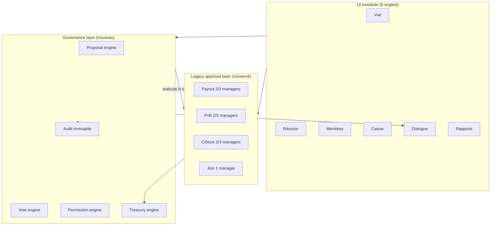
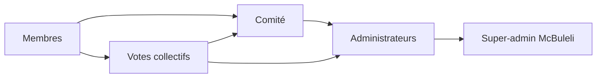
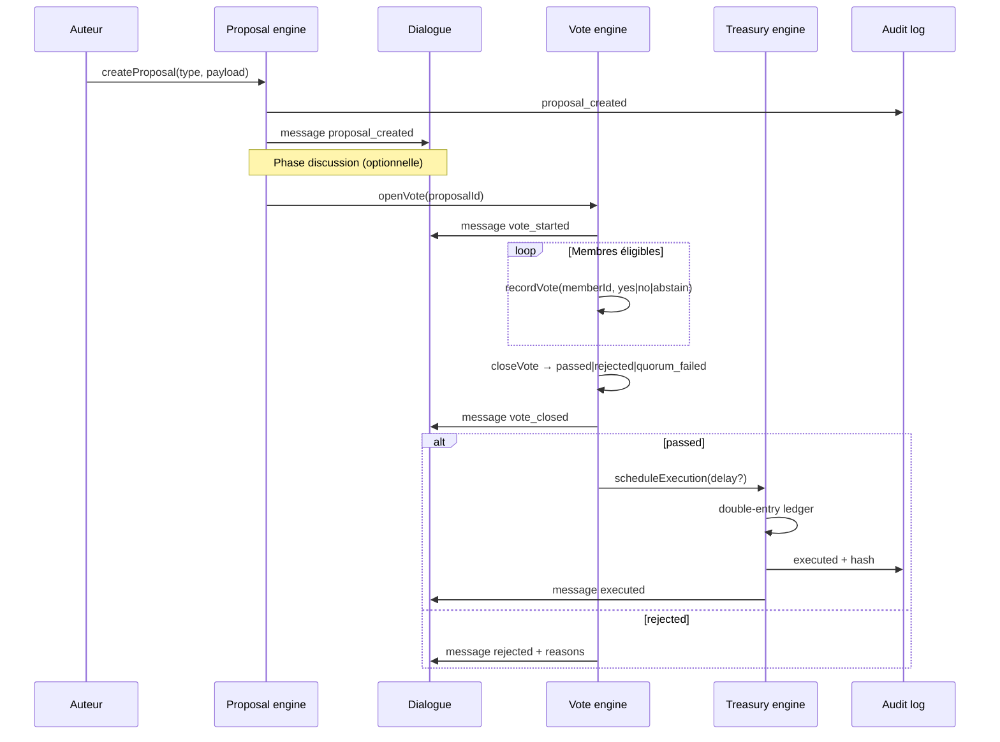
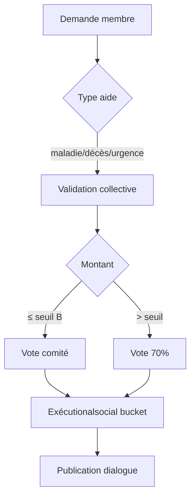
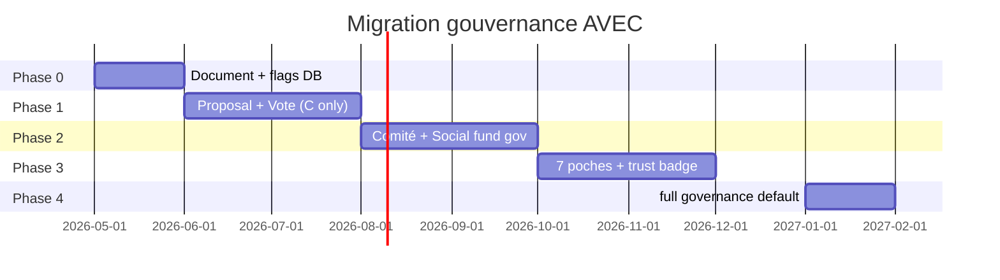

# Architecture gouvernance collective AVEC — McBuleli

> **Mission** : transformer le système actuel (quorum 2/3 managers) en **coopérative numérique démocratique**, sans casser l’UX, le dialogue, ni le flux d’approbations existant.  
> **Principe** : migration progressive — le code actuel devient la **legacy approval layer** ; un **governance layer** s’ajoute par-dessus.

**Documents liés** : [avec-model.md](./avec-model.md) · [avec-funds-architecture.md](./avec-funds-architecture.md) · [avec-menus.md](./avec-menus.md)

---

## 1. État actuel (baseline)

### Ce qui existe et reste

| Domaine | Implémentation | Fichiers clés |
|---------|----------------|---------------|
| Caisse USDT | Ledger append-only | `group_wallet_ledger_entries`, `fund-buckets.ts` |
| Crédits internes | Prêts AVEC + pénalités | `group_avec_loans`, `group-loans.ts`, `loan-terms.ts` |
| Approbations 2/3 | Managers uniquement | `payoutRequiredApprovals()` → `ceil(2/3 × N)` |
| Dialogue | Chat + cartes système | `group_messages`, `avec-chatroom.tsx` (poll 4s) |
| Audit | Journal in-group | `group_audit_log` |
| Fonds solidarité | Cotisation réunion | `social_fund_usdt` → bucket `social` |
| Rôles | admin · co_admin · member | `group_savings_memberships` |

### Problèmes identifiés

1. **2/3 managers = décision pour tout le groupe** — pas de vote membres.
2. **Initiateur peut voter** sur sa propre proposition (payout, prêt).
3. **Admin fondateur** non révocable par les membres.
4. **Règles / taux / co-admins** modifiables sans assemblée.
5. **Fonds social** collecté mais gouverné comme la caisse épargne (managers).
6. **Pénalités** créditées en bucket `savings` au lieu d’un fonds dédié.
7. **Pas de délai de sécurité** sur gros retraits.

---

## 2. Architecture cible — deux couches



| Couche | Rôle | Migration |
|--------|------|-----------|
| **Legacy** | Opérations mineures + exécution technique post-vote | Inchangée phase 0 |
| **Governance** | Propositions, votes, quorums, permissions, délais | Activée par `governanceMode` sur le groupe |

**Flag groupe** (nouveau champ) :

```typescript
governanceMode: "legacy" | "hybrid" | "full"
// legacy  = comportement actuel
// hybrid  = critiques → vote collectif ; mineures → legacy
// full    = tout passe par proposals (sauf cotisation auto)
```

---

## 3. Niveaux de gouvernance



| Niveau | Qui | Pouvoirs | Limites |
|--------|-----|----------|---------|
| **1 · Membre** | Tout membre `approved` | Cotiser, demander prêt/aide, voter (1 voix), proposer (selon règle) | Pas d’exécution trésorerie |
| **2 · Comité** | Sous-ensemble élu (3–7) | Valider opérations **B**, préparer propositions **C** | Pas de modification règles seul |
| **3 · Admin bureau** | admin + co_admin (max 4) | Exécuter après vote, proposer, modérer dialogue | Sous contrôle votes **C** |
| **4 · Super-admin système** | McBuleli Ops | Activer groupe, billing, suspension plateforme | Jamais caisse interne AVEC |
| **5 · Vote collectif** | Tous membres éligibles | Décisions **C**, charte, personnel | 1 membre = 1 voix |

**Règle d’or** : aucune personne seule ne contrôle argent + règles + personnel.

---

## 4. Taxonomie des décisions (A / B / C)

### A — Opérations mineures (auto / comité local)

| Opération | Validation | Exécution |
|-----------|------------|-----------|
| Cotisation parts (1–5) | Automatique si solde OK | `POST …/contributions` (existant) |
| Pénalité simple (< seuil) | Comité ou 1 manager | Ledger + message système |
| Validation cotisation | Automatique | Ledger |
| Petite dépense (< `minorExpenseMaxUsdt`) | 1 comité OU 2 managers legacy | Payout simplifié |

**Seuils configurables** (`GovernanceRule`) :

```typescript
minorExpenseMaxUsdt: 10        // défaut
mediumLoanMaxUsdt: 100
criticalWithdrawalUsdt: 500
```

### B — Opérations moyennes (vote comité)

| Opération | Quorum comité | Majorité |
|-----------|---------------|----------|
| Prêt moyen | 50% comité + 1 | Simple (>50%) |
| Aide sociale moyenne | 50% comité + 1 | Simple |
| Retrait moyen | 50% comité + 1 | Simple |

**Comité** = membres avec rôle `committee` (nouveau rôle granulaire).

### C — Opérations critiques (vote collectif)

| Opération | Quorum | Majorité | Délai vote | Délai exécution |
|-----------|--------|----------|------------|-----------------|
| Changement taux intérêt | 70% | 60% oui | 72h | 24h après clôture |
| Ajout / révocation admin | 70% | 60% | 72h | immédiat |
| Changement règles caisse | 70% | 60% | 72h | 24h |
| Gros retrait (> critique) | 70% | 60% | 48h | **24h cooling** |
| Modification fonds social (taux) | 70% | 60% | 72h | 24h |
| Fermeture cycle | 80% | 66% | 96h | auto |
| Dissolution groupe | 80% | 75% | 7j | 48h |

---

## 5. Moteur de votes et quorums

### Configuration par groupe (`GovernanceRule`)

```typescript
type GovernanceRule = {
  groupId: string;
  version: number;                    // immuable par version
  normalQuorumPct: 50;                // + 1 membre
  criticalQuorumPct: 70;
  ultraCriticalQuorumPct: 80;
  normalMajorityPct: 50;
  criticalMajorityPct: 60;
  ultraCriticalMajorityPct: 66;
  voteDurationHours: { A: 0, B: 24, C: 72 };
  executionDelayHours: { criticalWithdrawal: 24 };
  committeeSize: 5;
  minorExpenseMaxUsdt: string;
  mediumLoanMaxUsdt: string;
  criticalWithdrawalUsdt: string;
  socialFundMonthlyCapUsdt: string;
  socialFundPerMemberCapUsdt: string;
  socialFundMinDaysBetweenRequests: 30;
};
```

### Calcul quorum

```typescript
function requiredParticipants(
  eligibleCount: number,
  tier: "normal" | "critical" | "ultra",
  rules: GovernanceRule,
): number {
  const pct =
    tier === "ultra" ? rules.ultraCriticalQuorumPct :
    tier === "critical" ? rules.criticalQuorumPct :
    rules.normalQuorumPct;
  return Math.max(1, Math.ceil((eligibleCount * pct) / 100));
}

function isVotePassed(
  yes: number,
  no: number,
  abstain: number,
  participated: number,
  tier: VoteTier,
  rules: GovernanceRule,
): VoteResult {
  const quorum = requiredParticipants(eligibleCount, tier, rules);
  if (participated < quorum) return "quorum_failed";
  const majorityPct = /* selon tier */;
  const yesPct = yes / (yes + no || 1);
  if (yesPct >= majorityPct / 100) return "passed";
  return "rejected";
}
```

### Expiration & relance

- Vote ouvert → `closesAt = now + voteDurationHours`
- Cron `governance/tick` : si `closesAt` passé et quorum absent → `expired` → message dialogue + option relance (auteur ou comité)
- Relance max **2×** puis archivage

---

## 6. Flux propositions (nouveau flow)



### Modèle `Proposal`

```typescript
type Proposal = {
  id: uuid;
  groupId: uuid;
  authorUserId: uuid;
  type: ProposalType;           // voir enum ci-dessous
  riskTier: "A" | "B" | "C";
  status: "draft" | "discussion" | "voting" | "passed" | "rejected" | "expired" | "executed" | "cancelled";
  title: string;
  justification: string;
  financialImpactUsdt: string | null;
  beneficiaryUserId: uuid | null;
  payload: jsonb;               // type-specific
  requiredQuorumPct: number;
  requiredMajorityPct: number;
  voteOpensAt: timestamp | null;
  voteClosesAt: timestamp | null;
  executionScheduledAt: timestamp | null;
  executedAt: timestamp | null;
  legacyRequestId: uuid | null; // lien payout/loan/closure existant
  createdAt: timestamp;
};
```

### Enum `ProposalType`

```
// Trésorerie
payout_minor | payout_medium | payout_critical
loan_medium | loan_critical
social_aid_request | social_aid_grant

// Gouvernance
change_interest_rate | change_penalty_rate | change_charter
change_social_fund_amount | change_meeting_rules

// Personnel
appoint_admin | revoke_admin | appoint_committee | revoke_member | change_role_permissions

// Cycle
close_cycle | start_cycle | dissolve_group
```

---

## 7. Trésorerie — séparation des caisses

### 7 poches (évolution de `fund-buckets.ts`)

| Poche | Code ledger | Source | Usage |
|-------|-------------|--------|-------|
| **Épargne** | `savings` | Parts, remboursements principal | Prêts, retraits, clôture |
| **Crédit** | `credit` | Prêts en cours (comptabilité) | Suivi encours (pas liquidité) |
| **Fonds social** | `social` | Cotisation réunion, dons | Aides solidarité uniquement |
| **Pénalités** | `penalties` | Retards remboursement | Solidarité ou réserve (vote) |
| **Réserve urgence** | `reserve` | % cycle ou vote | Catastrophe collectif |
| **Frais système** | `admin` | Abonnement McBuleli | Plateforme |
| **Intérêts** | `interest` | Intérêts prêts | Épargne ou redistribution (vote) |

### Double écriture

Chaque `TreasuryTransaction` génère **2 lignes** ledger minimum :

```typescript
type TreasuryTransaction = {
  id: uuid;
  groupId: uuid;
  proposalId: uuid | null;
  txType: string;
  fromBucket: FundBucket;
  toBucket: FundBucket;
  amountUsdt: numeric;
  balanceBefore: Record<FundBucket, string>;
  balanceAfter: Record<FundBucket, string>;
  contentHash: string;          // sha256(canonical payload)
  prevHash: string | null;      // chaîne par groupe
  executedByUserId: uuid | null; // null si auto
  createdAt: timestamp;
};
```

**Règle** : mélange inter-poches interdit sans `ProposalType` explicite + vote si montant > seuil.

---

## 8. Fonds social — gouvernance collective

### Flow aide sociale



### Modèle `SocialFundRequest`

```typescript
type SocialFundRequest = {
  id: uuid;
  groupId: uuid;
  requesterUserId: uuid;
  aidType: "illness" | "death" | "emergency" | "disaster" | "maternity" | "accident";
  amountRequestedUsdt: string;
  aidMode: "grant" | "repayable" | "partial";
  justification: string;
  proofAttachmentUrl: string | null;
  proposalId: uuid;               // lien vote
  status: "pending" | "approved" | "rejected" | "paid";
  limitsSnapshot: jsonb;          // caps appliqués au moment T
};
```

### Limites automatiques

```typescript
function canRequestSocialAid(member, group, rules): LimitCheck {
  // max par membre / cycle
  // max par mois (groupe)
  // délai min entre 2 demandes
  // pas de cumul si prêt en défaut
}
```

---

## 9. Gestion personnel — séparation des pouvoirs

### Rôles granulaires (nouveau)

| Rôle | Permissions |
|------|-------------|
| `member` | Cotiser, voter, demander |
| `committee` | Valider B, proposer |
| `treasurer` | Exécuter paiements **après vote** — pas modifier règles |
| `credit_officer` | Proposer prêts — pas toucher fonds social |
| `secretary` | Publier PV, modérer dialogue — pas exécuter paiements |
| `co_admin` | Legacy + proposer C |
| `admin` | Bureau — **sous vote** pour actions C |

Matrice `RolePermission` :

```typescript
type RolePermission = {
  role: GroupRole;
  canPropose: ProposalType[];
  canVote: boolean;
  canExecuteTreasury: boolean;
  canModifyRules: boolean;
  canManageMembers: boolean;
  canApproveLegacyMinor: boolean;
};
```

**Actions RH sensibles** → toujours `ProposalType` + vote **C** :

- `appoint_admin` · `revoke_admin` · `revoke_member` · `change_role_permissions`

---

## 10. Dialogue — intégration (conservé + enrichi)

### Types messages existants (conservés)

`chat` · `proof` · `system` · `payout_pending` · `payout_decision` · `loan_decision` · `closure_decision`

### Nouveaux types (governance layer)

```
proposal_created
proposal_discussion
vote_started
vote_progress          // quorum % en temps réel
vote_closed
vote_quorum_failed
proposal_executed
proposal_rejected
social_aid_requested
governance_rule_changed
```

### Meta carte vote (exemple)

```json
{
  "proposalId": "…",
  "type": "change_interest_rate",
  "riskTier": "C",
  "yes": 12,
  "no": 3,
  "abstain": 1,
  "eligible": 20,
  "quorumRequired": 14,
  "quorumReached": true,
  "closesAt": "2026-05-27T12:00:00Z",
  "progressPct": 80
}
```

**Polling** : conserver 4s phase 1 ; phase 2 option SSE/WebSocket pour `vote_progress`.

---

## 11. Sécurité & anti-abus

| Menace | Mitigation |
|--------|------------|
| Collusion managers | Votes **C** = membres ; initiateur **exclu** du vote sur sa proposition |
| Auto-approbation | `approverUserId !== initiatedByUserId` (legacy + gov) |
| Retrait massif | Seuil **C** + délai 24h + notification tous membres |
| Modification règles sneak | Charte versionnée ; changement = proposal + 72h vote |
| Fraude aide sociale | Caps + preuve optionnelle + comité + audit |
| Replay vote | 1 vote / membre / proposal (unique index) |
| Tampering ledger | Chaîne hash `TreasuryTransaction` + append-only |

### Audit immuable

```typescript
type AuditLog = {
  id: uuid;
  groupId: uuid;
  actorUserId: uuid | null;
  action: string;
  entityType: "proposal" | "vote" | "treasury" | "member" | "rule";
  entityId: uuid;
  before: jsonb | null;
  after: jsonb | null;
  ipHash: string | null;
  contentHash: string;
  prevHash: string | null;
  createdAt: timestamp;
};
```

Étend `group_audit_log` existant avec `prevHash` / `contentHash` (migration additive).

---

## 12. Score confiance (informatif — pas de pouvoir)

```typescript
type MemberTrustScore = {
  userId: uuid;
  groupId: uuid;
  score: 0..100;        // affichage badge uniquement
  factors: {
    repaymentOnTime: number;
    meetingAttendance: number;
    tenureDays: number;
    voteParticipation: number;
  };
};
```

**Principe non négociable** : `1 membre = 1 voix` — le score **ne pondère jamais** les votes.  
Usage UX : badge réputation, priorité d’affichage dialogue, suggestion comité (vote séparé pour confirmer).

---

## 13. UX / UI — états (MobileFirst, sans casser les 6 onglets)

### Badges proposition (Dialogue + Caisse)

| État | Badge | Couleur |
|------|-------|---------|
| `discussion` | Discussion | gris |
| `voting` | Vote ouvert | bleu |
| `quorum_pending` | Quorum {n}% | amber |
| `passed_pending_exec` | Adopté · exécution {date} | vert |
| `executed` | Exécuté | vert foncé |
| `rejected` | Rejeté | rouge |
| `expired` | Expiré | gris |

### Nouveau sous-onglet Caisse (phase 2)

**Gouvernance** : liste propositions actives + bouton « Proposer » (selon permissions).

### Timeline décision (Rapports)

Fil chronologique : proposition → votes → exécution → ledger entries liées.

---

## 14. Modèles base de données (migration progressive)

### Phase 1 — Tables nouvelles (sans toucher legacy)

```sql
-- Règles gouvernance versionnées
CREATE TABLE group_governance_rules (
  id uuid PRIMARY KEY,
  group_id uuid NOT NULL REFERENCES group_savings_groups(id),
  version int NOT NULL,
  rules jsonb NOT NULL,
  approved_proposal_id uuid,
  effective_at timestamptz NOT NULL,
  created_at timestamptz DEFAULT now()
);

CREATE TABLE group_proposals (
  id uuid PRIMARY KEY,
  group_id uuid NOT NULL,
  author_user_id uuid NOT NULL,
  type varchar(64) NOT NULL,
  risk_tier varchar(1) NOT NULL,
  status varchar(32) NOT NULL,
  title text NOT NULL,
  justification text NOT NULL,
  financial_impact_usdt numeric(36,18),
  beneficiary_user_id uuid,
  payload jsonb NOT NULL DEFAULT '{}',
  required_quorum_pct int NOT NULL,
  required_majority_pct int NOT NULL,
  vote_opens_at timestamptz,
  vote_closes_at timestamptz,
  execution_scheduled_at timestamptz,
  executed_at timestamptz,
  legacy_request_id uuid,
  created_at timestamptz DEFAULT now()
);

CREATE TABLE group_votes (
  id uuid PRIMARY KEY,
  proposal_id uuid NOT NULL REFERENCES group_proposals(id),
  voter_user_id uuid NOT NULL,
  choice varchar(8) NOT NULL, -- yes|no|abstain
  weight numeric DEFAULT 1,  -- toujours 1 (future-proof)
  created_at timestamptz DEFAULT now(),
  UNIQUE(proposal_id, voter_user_id)
);

CREATE TABLE group_social_fund_requests (
  id uuid PRIMARY KEY,
  group_id uuid NOT NULL,
  requester_user_id uuid NOT NULL,
  proposal_id uuid REFERENCES group_proposals(id),
  aid_type varchar(32) NOT NULL,
  aid_mode varchar(16) NOT NULL,
  amount_requested_usdt numeric(36,18) NOT NULL,
  justification text,
  proof_attachment_url text,
  status varchar(32) NOT NULL,
  created_at timestamptz DEFAULT now()
);

CREATE TABLE group_treasury_transactions (
  id uuid PRIMARY KEY,
  group_id uuid NOT NULL,
  proposal_id uuid,
  tx_type varchar(64) NOT NULL,
  from_bucket varchar(16),
  to_bucket varchar(16),
  amount_usdt numeric(36,18) NOT NULL,
  balance_before jsonb,
  balance_after jsonb,
  content_hash varchar(64) NOT NULL,
  prev_hash varchar(64),
  executed_by_user_id uuid,
  created_at timestamptz DEFAULT now()
);

-- Rôles granulaires (extension membership)
ALTER TABLE group_savings_memberships
  ADD COLUMN IF NOT EXISTS granular_roles jsonb DEFAULT '[]';
```

### Phase 2 — Lien legacy

```sql
ALTER TABLE group_payout_requests ADD COLUMN proposal_id uuid;
ALTER TABLE group_avec_loans ADD COLUMN proposal_id uuid;
ALTER TABLE group_cycle_closure_requests ADD COLUMN proposal_id uuid;
ALTER TABLE group_savings_groups ADD COLUMN governance_mode varchar(16) DEFAULT 'legacy';
```

---

## 15. Engines (services)

```
src/lib/avec/governance/
  proposal-engine.ts      # create, classify tier, open/close vote
  vote-engine.ts          # record, tally, quorum, expiry
  permission-engine.ts    # canPropose, canVote, canExecute
  treasury-engine.ts      # double-entry, buckets, cooling delay
  governance-messaging.ts # publish to group_messages
  governance-tick.ts        # cron: expire votes, execute scheduled
  trust-score.ts          # informatif only
```

### Pseudo-code exécution post-vote

```typescript
async function onProposalPassed(proposal: Proposal) {
  await permissionEngine.assertCanExecute(proposal);
  const delay = rules.executionDelayHours[proposal.type] ?? 0;
  if (delay > 0) {
    await scheduleExecution(proposal.id, addHours(now(), delay));
    await messaging.publish(proposal.groupId, "passed_pending_exec", { delay });
    return;
  }
  await treasuryEngine.executeFromProposal(proposal);
  await auditLog.write({ action: "proposal_executed", proposal });
  await messaging.publish(proposal.groupId, "proposal_executed", { proposal });
}
```

---

## 16. Scénarios métier

### S1 — Gros retrait (critique)

1. Trésorier crée proposition `payout_critical` 800 USDT.
2. Dialogue : carte + discussion 24h.
3. Vote 72h · quorum 70% · majorité 60%.
4. Adopté → exécution planifiée +24h (cooling).
5. Membres notifiés · peuvent contester → nouvelle proposition annulation (ultra C).
6. Exécution → double écriture `savings` → wallet membre.

### S2 — Révoquer co-admin abusif

1. Membre (ou comité) propose `revoke_admin` cible co_admin X.
2. Vote collectif 70% · X **ne vote pas** · admin fondateur **vote** (1 voix).
3. Adopté → rôle X → `member` · audit · message dialogue.

### S3 — Aide sociale décès

1. Membre demande `social_aid_request` · type `death` · 50 USDT · grant.
2. Limites OK · proposition auto · vote comité (B) ou collectif si > cap.
3. Exécution depuis bucket `social` uniquement.

### S4 — Changement taux intérêt 10% → 12%

1. Proposition `change_interest_rate` · tier C.
2. Vote 72h · quorum 70%.
3. Nouvelle `GovernanceRule` version N+1 · effective après délai.
4. Prêts futurs utilisent nouveau taux · encours = taux signature (grandfathering).

---

## 17. Edge cases

| Cas | Comportement |
|-----|--------------|
| Quorum non atteint | `expired` · relance possible · pas d’exécution |
| Égalité yes/no | Rejet (majorité requise strictement) |
| Membre rejoint pendant vote | Pas éligible (snapshot électeurs à `voteOpensAt`) |
| Admin seul manager | Legacy 1/1 mineur ; **C** toujours vote membres |
| Groupe < 5 membres | Quorum plancher = min 3 participants |
| Dissolution avec dettes | Blocage · proposition clôture forcée d’abord |
| Ops suspend groupe | Gouvernance gelée · lecture seule |

---

## 18. Scénarios fraude

| Attaque | Détection | Réponse |
|---------|-----------|---------|
| 2 managers collusion | Actions C contournées si `governanceMode=hybrid` | Forcer vote membres |
| Faux décès (aide) | Preuve + comité + plafond | Rejet + audit flag |
| Vote fantôme | 1 vote / membre · session auth | Rejet doublon |
| Retrait après vote puis annulation compte | Cooling 24h + wallet lock | Annulation exécution |
| Modification règles via API directe | Permission engine middleware | 403 + audit |

---

## 19. Plan de migration (4 phases)



| Phase | Scope | Legacy |
|-------|-------|--------|
| **0** | Doc, `governance_mode`, audit hash | 100% legacy |
| **1** | Votes **C** : admin, règles, gros retraits, clôture | Hybrid opt-in |
| **2** | Comité, aides sociales, exclusion initiateur vote | Hybrid |
| **3** | 7 poches, pénalités → bucket dédié, trust badge | Hybrid |
| **4** | `full` par défaut nouveaux groupes | Legacy deprecated |

---

## 20. Compatibilité API (wrappers)

Les routes existantes **restent** :

```
POST /api/groups/:id/payouts
POST /api/groups/:id/loans
POST /api/groups/:id/closure
```

**Comportement hybrid** :

```typescript
async function proposePayout(input) {
  const group = await getGroup(input.groupId);
  if (group.governanceMode === "legacy") {
    return legacyProposePayout(input);           // actuel
  }
  const tier = classifyPayoutTier(input.amount);
  if (tier === "A") return legacyProposePayout(input);
  return proposalEngine.create({
    type: `payout_${tier}`,
    payload: input,
  });
}
```

---

## 21. Livrables récap

| # | Livrable | Section |
|---|----------|---------|
| 1 | Architecture complète | §2–3, §15 |
| 2 | Flux détaillés | §6, §8, §16 |
| 3 | Règles métier | §4–5, §8–9 |
| 4 | Scénarios | §16 |
| 5 | Modèles DB | §14 |
| 6 | Permissions | §9 |
| 7 | Logique votes | §5 |
| 8 | Logique trésorerie | §7 |
| 9 | Diagrammes | §2, §6, §8, §19 |
| 10 | Pseudo-code | §5, §15 |
| 11 | Edge cases | §17 |
| 12 | Sécurité anti-abus | §11 |
| 13 | Scénarios fraude | §18 |
| 14 | UX states | §13 |
| 15 | Événements temps réel | §10 |

---

## 22. Prochaine étape recommandée (implémentation)

**Sprint 1** (minimal, haute valeur) :

1. Migration `governance_mode` + tables `group_proposals` / `group_votes`.
2. `ProposalType` : `revoke_admin`, `payout_critical`, `change_interest_rate`.
3. Wrapper hybrid sur `POST …/payouts` si montant > seuil.
4. Cartes dialogue `vote_started` / `vote_progress` / `vote_closed`.
5. Exclusion initiateur du vote (fix legacy + gov).
6. Cron `governance/tick` + route interne cron.

**Ne pas faire au sprint 1** : 7 poches, WebSocket, dissolution, trust score pondéré.

---

*Document produit pour McBuleli AVEC — gouvernance collective intelligente. Compatible avec le code existant (`group-savings-payouts.ts`, `group-loans.ts`, `group-cycle-closure.ts`, `group-savings-messaging.ts`).*
