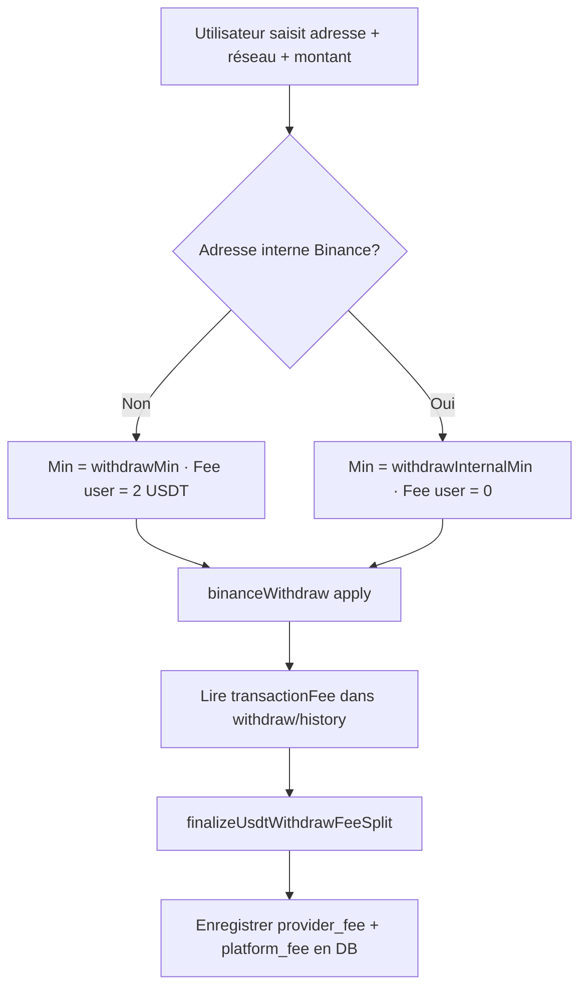

# Retraits USDT — frais réseau Binance (gas) & transferts internes

Ce document décrit comment **Binance** calcule les **frais réseau** (souvent appelés *gas* on-chain) lors d’un retrait USDT, la différence entre **retrait on-chain externe** et **transfert interne Binance**, et comment **McBuleli** doit interpréter ces valeurs pour les retraits automatisés.

Références officielles :

- [All Coins' Information (`GET /sapi/v1/capital/config/getall`)](https://developers.binance.com/docs/wallet/capital/all-coins-info)
- [Withdraw (`POST /sapi/v1/capital/withdraw/apply`)](https://developers.binance.com/docs/wallet/capital/withdraw)
- [Withdraw History (`GET /sapi/v1/capital/withdraw/history`)](https://developers.binance.com/docs/wallet/capital/withdraw-history)
- [FAQ transfert interne Binance](https://www.binance.com/en/support/faq/detail/360037037312)
- [FAQ network fees / gas](https://www.binance.com/en/support/faq/detail/daa7138d192646829b8fe2a1ba0fef59)
- [Binance Academy — gas Ethereum](https://www.binance.com/en/academy/articles/how-do-gas-fees-work-on-ethereum)
- [Tableau officiel frais dépôt/retrait (`/fee/cryptoFee`)](https://www.binance.com/en/fee/cryptoFee)

---

## Vocabulaire

| Terme Binance (UI / API) | Signification |
|--------------------------|---------------|
| **Network fee** / `withdrawFee` | Frais facturés par Binance pour couvrir le coût on-chain (gas Tron, BSC, Ethereum, etc.) sur un retrait **externe**. |
| **Minimum withdrawal** / `withdrawMin` | Montant net minimum pour un retrait **on-chain** vers une adresse **non-Binance**. |
| **Minimum internal** / `withdrawInternalMin` | Montant minimum pour un **transfert interne** vers une adresse détenue par un autre compte Binance. |
| **Internal transfer** | Envoi vers une adresse reconnue comme appartenant à l’écosystème Binance : **pas de tx on-chain**, **frais réseau = 0**. |
| **Gas** (blockchain) | Coût réel payé aux validateurs/miners. Binance l’agrège dans `withdrawFee` ; l’utilisateur ne voit pas le détail du gas unitaire. |

Sur l’app Binance, quand l’adresse destination est interne, l’UI affiche typiquement :

```text
Network fee: ~~1.3~~ 0.00 USDT
```

Le tarif catalogue (`1.3`) est barré ; le frais **effectif** est `0.00`.

---

## Tarif officiel Binance USDT ([cryptoFee](https://www.binance.com/en/fee/cryptoFee), mai 2026)

Pour **tous** les réseaux USDT listés par Binance :

- **Minimum withdrawal** : **5 USDT**
- **Deposit fee** : **0 USDT**

Réseaux **McBuleli** (les 3 que nous exposons) :

| McBuleli | Réseau Binance | Min retrait | Fee retrait externe |
|----------|----------------|-------------|---------------------|
| `TRC20` | Tron (TRC20) | 5 USDT | **1.3 USDT** |
| `BEP20` | BNB Smart Chain (BEP20) | 5 USDT | **0.01 USDT** |
| `ERC20` | Ethereum (ERC20) | 5 USDT | **0.4 USDT** |

Autres réseaux USDT Binance (non exposés McBuleli aujourd’hui) — pour référence :

| Réseau | Fee retrait |
|--------|-------------|
| opBNB | 0.015 |
| Solana | 0.3 |
| Arbitrum One | 0.1 |
| Polygon POS | 0.07 |
| Optimism | 0.04 |
| … | voir [cryptoFee](https://www.binance.com/en/fee/cryptoFee) |

Ces valeurs correspondent au champ API `withdrawFee` de `GET /sapi/v1/capital/config/getall`. **Ne pas hardcoder** — relire l’API à chaque quote (Binance ajuste parfois les tarifs).

Mapping code : `src/lib/networks.ts` (`USDT_NETWORKS[].binanceNetwork`).

### Ce que disent les docs Binance sur le « gas »

| Source | Point clé |
|--------|-----------|
| [FAQ network fees](https://www.binance.com/en/support/faq/detail/daa7138d192646829b8fe2a1ba0fef59) | Le **network fee** (= gas) va à la **blockchain**, pas à Binance. Sur Tron, le coût varie selon bandwidth/energy (0.5 à 25 TRX selon charge). |
| [Academy Ethereum gas](https://www.binance.com/en/academy/articles/how-do-gas-fees-work-on-ethereum) | Sur Ethereum : `base fee` + `priority fee` (gwei) × gas units — variable selon congestion. Binance agrège tout dans le `withdrawFee` affiché. |
| [cryptoFee](https://www.binance.com/en/fee/cryptoFee) | Tarif **forfaitaire par réseau** affiché à l’utilisateur ; inclut le coût réseau + marge opérationnelle Binance. |
| [FAQ internal transfer](https://www.binance.com/en/support/faq/detail/360037037312) | Vers adresse **Binance interne** : fee réseau **0**, crédit instantané, TxID = « Internal ». |

---

## Deux scénarios de retrait

### 1. Retrait externe (on-chain)

- L’adresse destination **n’appartient pas** à un compte Binance.
- Binance envoie une transaction on-chain ; un **TxID** blockchain est généré.
- Frais réseau = `withdrawFee` du réseau (débités du compte émetteur).
- Minimum = `withdrawMin`.
- Dans l’historique API : `transactionFee` > 0 en général.

### 2. Transfert interne Binance (même adresse, compte Binance)

- L’adresse destination est **enregistrée sur un autre compte Binance** (même réseau).
- Pas de transaction blockchain publique ; TxID affiché **« Internal »** côté Binance.
- Frais réseau effectif = **0** (UI : tarif barré).
- Minimum = `withdrawInternalMin` (souvent très bas, ex. `0.000001` USDT).
- Paramètre API `transactionFeeFlag` (transfert interne uniquement) :
  - `false` (défaut) : frais restitués au compte émetteur.
  - `true` : frais imputés au compte destinataire.

McBuleli exécute les retraits via `POST /sapi/v1/capital/withdraw/apply` (`src/lib/binance.ts` → `binanceWithdraw`). Binance décide automatiquement si le transfert est interne ou externe **au moment de l’apply**, en fonction de l’adresse + réseau + memo.

---

## Champs API essentiels (`config/getall`)

Pour chaque entrée `networkList` de la coin `USDT` :

| Champ | Usage McBuleli |
|-------|----------------|
| `withdrawFee` | Tarif catalogue réseau (coût Binance si retrait **externe**). Lu par `binanceUsdtWithdrawFee()`. |
| `withdrawMin` | Plancher net externe — affichage UI + validation côté serveur. |
| `withdrawInternalMin` | Plancher net si adresse interne Binance détectée. |
| `withdrawMax` | Plafond par retrait. |
| `withdrawEnable` | Réseau disponible ou non. |
| `withdrawTag` | `true` → memo/tag obligatoire (`addressTag` à l’apply). |
| `addressRegex` / `memoRegex` | Validation format adresse. |
| `estimatedArrivalTime` | SLA affiché à l’utilisateur (minutes). |

Exemple de structure (extrait doc Binance) :

```json
{
  "network": "TRX",
  "withdrawFee": "1.3",
  "withdrawMin": "5",
  "withdrawInternalMin": "0.000001",
  "withdrawTag": false
}
```

---

## Détection « wallet interne Binance »

### Côté Binance (référence UX)

1. L’utilisateur saisit adresse + réseau.
2. Binance interroge son registre d’adresses de dépôt utilisateurs.
3. Si match → mode **Internal** : frais barrés à 0, minimum abaissé.

### Côté McBuleli (état actuel vs cible)

| Étape | État actuel | Cible |
|-------|-------------|-------|
| Quote avant confirmation | Fee fixe **2 USDT** + min net **> 10 USDT** (`withdraw-fees.ts`) | Quote dynamique : adresse + réseau → `{ isInternal, userFee, minNet, binanceListFee }` |
| Lecture tarif Binance | `withdrawFee` catalogue uniquement | + `withdrawMin` / `withdrawInternalMin` par réseau |
| Détection interne | **Non implémentée** | Heuristique : adresse connue McBuleli **ou** quote Binance (pas d’endpoint preview public documenté) |
| Exécution worker | `binanceWithdraw` puis `transactionFee` dans l’historique | Réconciliation `finalizeUsdtWithdrawFeeSplit` avec fee réel |

**Important :** Binance ne documente pas d’endpoint « dry-run » public pour prévisualiser le fee d’une adresse. Options pratiques :

1. **Après exécution** — lire `transactionFee` dans `GET /sapi/v1/capital/withdraw/history` (déjà fait dans `wallet-withdraw-queue.ts`).
2. **Avant exécution** — maintenir un cache des adresses de dépôt Binance McBuleli ; pour les retraits vers d’**autres** comptes Binance, accepter que la détection exacte se fasse au moment de l’apply (fee 0 confirmé en historique).
3. **Adresses McBuleli** — si l’utilisateur retire vers une adresse de dépôt d’un autre user McBuleli, préférer le **transfert interne McBuleli** (`/api/wallet/transfer`) plutôt qu’un retrait Binance.

---

## Modèle économique McBuleli (fee split)

### Principe

L’utilisateur paie un **forfait plateforme** (aujourd’hui **2 USDT** sur retrait externe). Ce forfait est **splitté** :

```text
userFee (2 USDT) = providerFee (coût Binance) + platformFee (marge McBuleli)
```

Implémentation : `src/lib/withdraw-fee-split.ts` → `computeWithdrawFeeSplit`.

### Retrait externe (exemple TRC20, `withdrawFee = 1.3`)

| Composant | Montant |
|-----------|---------|
| Net reçu par l’utilisateur | 10 USDT |
| Fee utilisateur (McBuleli) | +2 USDT |
| **Total débité** | 12 USDT |
| `providerFee` (Binance) | 1.3 USDT |
| `platformFee` (McBuleli) | 0.7 USDT |

Binance prélève ~1.3 USDT sur le compte hot wallet McBuleli ; le reste du forfait utilisateur reste marge plateforme.

### Transfert interne Binance (fee réseau = 0)

Quand Binance barre le fee (`~~1.3~~ → 0.00`) :

| Composant | Montant cible |
|-----------|---------------|
| Net reçu | ex. 2 USDT (min abaissé) |
| Fee affiché à l’user | **0 USDT** (transfert interne) |
| `providerFee` réel | **0** (`transactionFee` historique) |
| `platformFee` / marge | **Économie du fee catalogue** (ex. 1.3 USDT) — bénéfice McBuleli car aucun coût réseau Binance |

**Règle métier stricte :** la marge sur transfert interne = `withdrawFee` catalogue du réseau **non payé à Binance**, pas le forfait 2 USDT externe. Ne pas confondre :

- **Externe** : user paie 2 USDT → split provider + platform.
- **Interne Binance** : user paie 0 → McBuleli conserve l’équivalent du `withdrawFee` catalogue comme profit net (aucun débit réseau).

Schéma :



---

## Flux technique McBuleli (fichiers)

| Fichier | Rôle |
|---------|------|
| `src/lib/binance.ts` | `fetchBinanceCoinConfigs`, `binanceUsdtWithdrawFee`, `binanceWithdraw`, `binanceWithdrawHistoryById` |
| `src/lib/withdraw-fees.ts` | Validation montant net, fee fixe utilisateur, minimum |
| `src/lib/withdraw-fee-split.ts` | Split provider / platform ; réconciliation post-retrait |
| `src/app/api/config/withdraw-fees/route.ts` | Config publique (fee, min, `binanceFeeByNetwork`) |
| `src/app/api/withdrawals/route.ts` | Création retrait + step-up (TOTP / passkey) |
| `src/lib/wallet-withdraw-queue.ts` | Worker cron : apply Binance + finalize fee split |
| `src/app/app/withdraw/page.tsx` | UI retrait |
| `drizzle/0049_withdraw_fee_split.sql` | Colonnes `provider_fee`, `platform_fee` |

### Colonnes DB (`withdrawals`)

- `amount` — net envoyé (on-chain ou interne).
- `fee` — fee **facturé à l’utilisateur** McBuleli.
- `provider_fee` — part allouée au coût Binance (réseau).
- `platform_fee` — marge McBuleli après réconciliation.

---

## Checklist validation d’un retrait (ops / dev)

Avant d’approuver ou debugger un ticket :

1. **Adresse** — format valide pour le réseau (`isValidAddressForNetwork`).
2. **Réseau** — cohérent avec l’adresse (TRC20 ↔ `T…`, BEP20/ERC20 ↔ `0x…`).
3. **Memo / tag** — requis si `withdrawTag = true` pour ce réseau ; sinon **ne pas** envoyer `addressTag` (erreur Binance `-4106`).
4. **Montant net** — ≥ `withdrawMin` (externe) ou ≥ `withdrawInternalMin` (interne).
5. **Frais utilisateur** — 2 USDT (externe) ou 0 (interne) selon détection.
6. **Solde McBuleli** — `balance >= net + userFee`.
7. **Après apply** — vérifier `transactionFee` dans l’historique ; mettre à jour `provider_fee` / `platform_fee`.
8. **TxID** — présent si externe ; « Internal » si transfert interne Binance.

---

## Erreurs fréquentes

| Symptôme UI | Cause probable |
|-------------|----------------|
| « net must be > 10 USDT » | Validation McBuleli (`MIN_WITHDRAW_NET_USDT_EXCLUSIVE_FLOOR`) — indépendante du min Binance (5 USDT). |
| « Action failed » après passkey | Montant sous le minimum **ou** step-up expiré ; vérifier cookie `mcbuleli_step_up` et message API exact. |
| Retrait Binance rejeté | Réseau/adresse mismatch, memo interdit, montant < `withdrawMin`, IP API non whitelistée. |
| `platform_fee` incohérent | Réconciliation faite avec fee catalogue au lieu de `transactionFee` réel — toujours préférer l’historique post-retrait. |

---

## Variables d’environnement

| Variable | Rôle |
|----------|------|
| `BINANCE_WALLET_API_KEY` / `BINANCE_WALLET_API_SECRET` | Clé avec **Reading + Withdrawals** |
| IP whitelist Binance | Outbound IP du serveur Render (voir `docs/wallet-cron-render.md`, `/api/config/outbound-ip`) |
| `WALLET_AUTOMATION_ENABLED` | Active worker retrait auto |

---

## Évolutions prévues (roadmap technique)

1. **Endpoint quote** — `GET /api/config/withdraw-quote?network=&address=` retournant min/fee/internal.
2. **Lecture `withdrawMin` / `withdrawInternalMin`** depuis `getall` (pas seulement `withdrawFee`).
3. **Alignement minimum McBuleli** — externe : max(McBuleli policy, Binance `withdrawMin`) ; interne : `withdrawInternalMin`.
4. **Fee interne** — user `0` ; profit = `withdrawFee` catalogue non consommé.
5. **Tests** — cas TRC20 externe (fee 1.3), BEP20 externe (fee 0.01), interne Binance (fee 0), réconciliation historique.

---

## Recoupe système McBuleli vs Binance (état actuel)

| Paramètre | Binance ([cryptoFee](https://www.binance.com/en/fee/cryptoFee)) | McBuleli aujourd’hui | Écart |
|-----------|----------------------------------------------------------------|----------------------|-------|
| Min retrait externe | **5 USDT** (tous réseaux) | **> 10 USDT** (`withdraw-fees.ts`) | ❌ Trop strict — bloque des retraits valides Binance |
| Fee réseau TRC20 | **1.3 USDT** | Lu via API (`binanceUsdtWithdrawFee`) | ✅ OK en lecture |
| Fee réseau BEP20 | **0.01 USDT** | Lu via API | ✅ OK en lecture |
| Fee réseau ERC20 | **0.4 USDT** | Lu via API | ✅ OK en lecture |
| Fee utilisateur McBuleli | N/A (Binance affiche seulement le network fee) | **2 USDT fixe** toujours | ⚠️ Pas de distinction interne/externe |
| Transfert interne Binance | **0 USDT** (fee barré) | Non détecté — fee 2 USDT quand même | ❌ À implémenter |
| Min transfert interne | Très bas (`withdrawInternalMin`) | Toujours > 10 USDT | ❌ Bloque ex. 2 USDT vers wallet Binance |

---

## Scénarios chiffrés (réf. [cryptoFee USDT](https://www.binance.com/en/fee/cryptoFee))

### Scénario A — Retrait externe TRC20, 20 USDT net

**Contexte :** User McBuleli retire vers MetaMask / Trust Wallet (adresse **non-Binance**), réseau TRC20.

| Étape | Binance | McBuleli actuel | McBuleli cible |
|-------|---------|-----------------|----------------|
| Min net | ≥ 5 USDT | > 10 USDT | ≥ 5 USDT |
| Net demandé | 20 USDT | 20 USDT | 20 USDT |
| Fee réseau Binance | 1.3 USDT (débit hot wallet McBuleli) | idem | idem |
| Fee facturé user | 1.3 USDT (Binance UI) | **+2 USDT** McBuleli | **+2 USDT** McBuleli |
| Total débité user | N/A | **22 USDT** | **22 USDT** |
| Split compta | N/A | provider=1.3, platform=**0.7** | idem |

**Verdict actuel :** Fonctionne si net > 10. Marge McBuleli = 0.7 USDT sur ce ticket.

---

### Scénario B — Retrait externe BEP20, 6 USDT net

**Contexte :** Adresse externe BSC, montant modeste.

| | Binance | McBuleli actuel |
|---|---------|-----------------|
| Min | 5 USDT ✅ | > 10 USDT ❌ **refusé** |
| Fee Binance | 0.01 USDT | 0.01 USDT |
| Fee user | 0.01 USDT | +2 USDT |
| Total user | ~6.01 USDT | bloqué |

**Verdict :** Binance accepterait 6 USDT ; McBuleli refuse. C’est le cas typique « net must be > 10 » alors que Binance dit min 5.

---

### Scénario C — Transfert interne Binance TRC20, 2 USDT net

**Contexte :** Adresse `TVmAHu4G…` appartient à un autre compte Binance. UI Binance : `~~1.3~~ 0.00 USDT`.

| | Binance | McBuleli actuel | McBuleli cible |
|---|---------|-----------------|----------------|
| Min net | ~0.000001 (interne) | > 10 ❌ | ≥ `withdrawInternalMin` |
| Net | 2 USDT ✅ | **refusé** | 2 USDT ✅ |
| Fee réseau effectif | **0 USDT** | 1.3 non payé si apply réussit | **0 USDT** |
| Fee user | **0 USDT** | **+2 USDT** ❌ | **0 USDT** |
| Total débité user | 2 USDT | bloqué | **2 USDT** |
| Profit McBuleli | N/A | N/A | **1.3 USDT** (= fee catalogue TRC20 économisé, `platform_fee`) |
| TxID | « Internal » | — | « Internal » |

**Verdict :** C’est le cas de vos captures d’écran. Aujourd’hui McBuleli **bloque** (min 10) et **ne modélise pas** le profit interne.

---

### Scénario D — Retrait externe ERC20, 15 USDT net

**Contexte :** Adresse Ethereum externe. Fee catalogue Binance = **0.4 USDT** ([cryptoFee](https://www.binance.com/en/fee/cryptoFee)).

| | Valeur |
|---|--------|
| Net user | 15 USDT |
| Fee user McBuleli | +2 USDT |
| Total débité | 17 USDT |
| Coût Binance réel | 0.4 USDT |
| Marge McBuleli | **1.6 USDT** |

**Note :** ERC20 est moins cher que TRC20 sur Binance aujourd’hui (0.4 vs 1.3) — contresens courant « ERC20 = cher » car Binance fixe un forfait stable, pas le gas spot Ethereum.

---

### Synthèse des actions à coder

1. Lire `withdrawMin` (5) et `withdrawInternalMin` depuis `getall` — remplacer le floor hardcodé 10.
2. Quote dynamique adresse + réseau → `isInternal`, `userFee`, `minNet`.
3. Interne : `userFee = 0`, profit = `withdrawFee` catalogue en `platform_fee` après `transactionFee = 0` confirmé.
4. Externe : conserver forfait 2 USDT ; split = min(binanceFee, 2) provider + reste platform.

---

## Voir aussi

- `docs/wallet-cron-render.md` — crons dépôt / retrait
- `docs/email-resend.md` — emails retrait USDT (FEE, TOTAL, TXID)
- `README.md` — workflow agent retrait manuel
