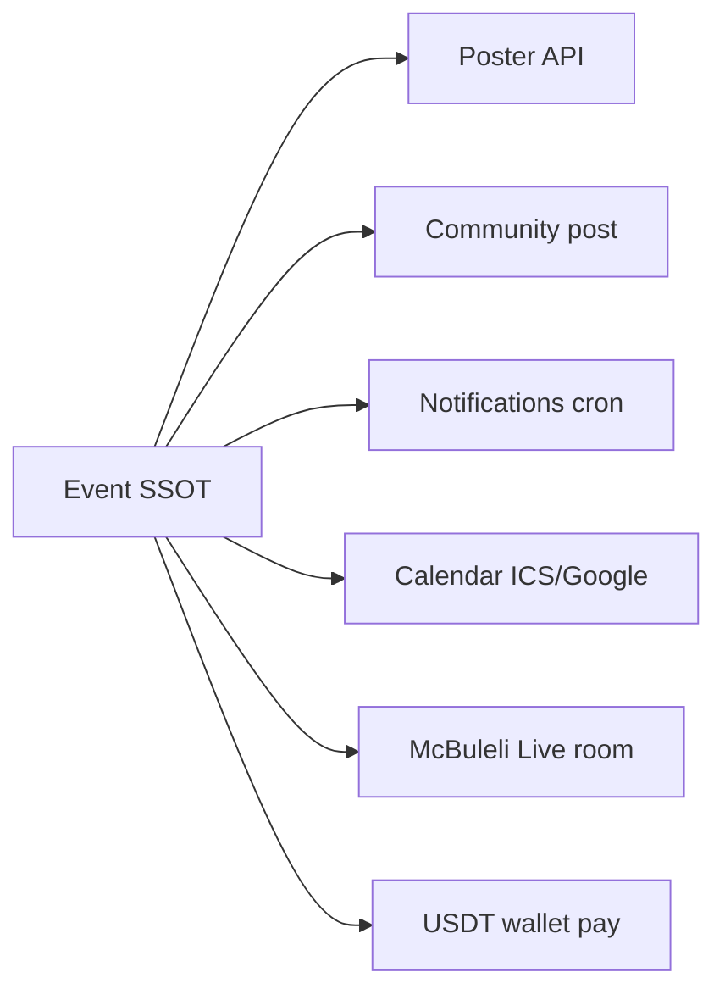

# Events & Trainings



## Tables

| Table | Role |
|-------|------|
| `academy_training_events` | Source of truth |
| `academy_training_event_participants` | Enrollment + payment |
| `academy_training_event_reminders` | Deduped scheduler |

## API

| Method | Path |
|--------|------|
| POST | `/api/events` |
| GET | `/api/events` |
| GET/PATCH/DELETE | `/api/events/:id` |
| POST | `/api/events/:id/publish` |
| POST | `/api/events/:id/join` |
| POST | `/api/events/:id/pay` |
| GET | `/api/events/:id/participants` |
| GET | `/api/events/:id/poster?template=square\|portrait\|banner` |
| GET | `/api/events/:id/calendar?format=ics` |
| GET | `/api/events/:id/live` |
| POST | `/api/internal/events/reminders` (cron) |

## Roles

- **SYSTEM_ADMIN** → `super_admin`
- **TRAINER** → `trainerId` / `createdBy`
- **STUDENT** → join / pay / live

## Prod

1. Migration `0080_academy_training_events.sql`
2. Cron : `npm run cron:events-reminders` (Render, `CRON_SECRET`)
3. Admin : `/admin/events`
4. **Campagne bonus dépôt** : retirée du code — désactiver `DEPOSIT_LAUNCH_*` sur Render si encore présent

## Tests

```bash
npm run test:events
```
