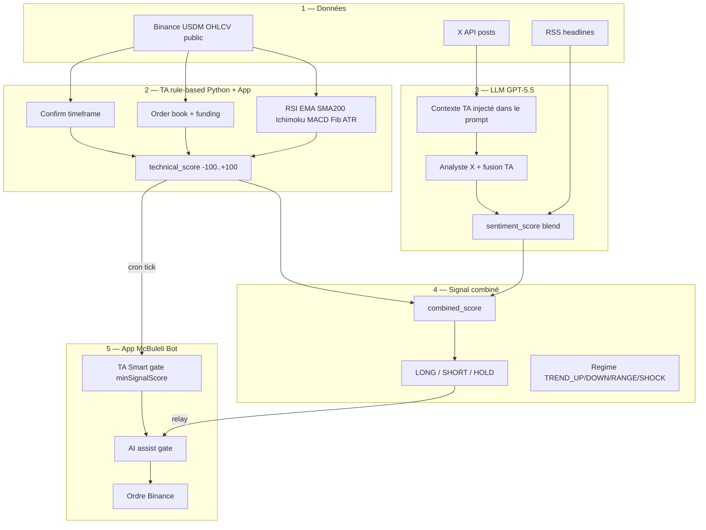

# McBuleli — analyse de marché haut niveau (IA + Bot)

Pipeline en **5 étapes** avec rôles séparés. L’objectif : précision multi-facteurs sans que l’IA et le bot se contredisent.

## Vue d’ensemble



## Étape 1 — Collecte des données

| Source | Indicateurs / contenu | Rôle |
|--------|----------------------|------|
| **Binance USDM** | OHLCV entry + confirm TF | Prix, volume, calcul indicateurs |
| **Order book** | Imbalance bid/ask | Pression court terme |
| **Funding** | Taux perp | Biais long/short crowd |
| **RSS** | Titres Coindesk, Cointelegraph… | Sentiment lexicon |
| **X (Twitter)** | Posts récents (Bearer) | Narratif, whales, FUD/FOMO |

Fichiers : `market_data.py`, `news_data.py`, `x_twitter.py`

## Étape 2 — Analyse technique (rule-based)

Même logique que l’app Node (`evaluate-signal.ts` / `evaluate_technical_score`).

| Facteur | Poids typique | Interprétation |
|---------|---------------|----------------|
| RSI14 | ±18 / ±6 | Survente / surachat / biais |
| EMA20 vs EMA50 + prix | ±14 | Tendance court terme |
| SMA200 | ±8 | Régime long terme |
| Ichimoku cloud | ±12 | Structure tendance |
| TK / KJ | ±6 | Momentum Ichimoku |
| Fib 38.2 / 61.8 | ±10 / -8 | Supports / résistances |
| MACD hist + cross | ±5 / +8 | Momentum |
| Order book | ±10 | Pression immédiate |
| Funding | ±5 | Biais perp |
| ATR élevé | ×0.7 score | Réduit conviction (volatilité) |

**Multi-timeframe** : si entry TF bullish mais confirm TF &lt; +15 → score entry × 0.6 (« Higher TF not confirming »).

**Régime** (`regime_detector.py`) : TREND_UP, TREND_DOWN, RANGE, SHOCK (news/ATR).

Fichier : `signal_engine.py`, `indicators.py`, `market_analysis_context.py`

## Étape 3 — LLM GPT-5.5 (analyste X + TA)

| Paramètre | Défaut | Note |
|-----------|--------|------|
| `OPENAI_MODEL` | `gpt-5.5` | Responses API si modèle gpt-5* |
| `X_LLM_BLEND_WEIGHT` | `0.55` | Poids X+LLM vs lexicon RSS |
| `OPENAI_TEMPERATURE` | `0.1` | Réponses stables JSON |

Le prompt système reçoit maintenant le **bloc TA complet** (pas seulement les tweets). Le modèle doit renvoyer :

- `sentiment`, `confidence`, `signals`
- `ta_alignment` : `aligned` | `mixed` | `against_ta`
- `position_action`, `recommended_direction`, `reason`

Si `against_ta` → confiance plafonnée (≤45).

Fichiers : `x_analyst_prompt.py`, `x_llm_analyzer.py`, `openai_client.py`

## Étape 4 — Score combiné & action

```
combined = technical_score
         + ajustement news/X (sentiment, position_action, rumeurs)
         + pénalité si confirm TF diverge
```

| combined_score | Action worker (`SIGNAL_MIN_EDGE`) |
|----------------|-----------------------------------|
| ≥ +15 (défaut) | LONG |
| ≤ -15 | SHORT |
| entre les deux | HOLD, confidence 0 |

`confidence` worker = `|combined_score|` si LONG/SHORT.

Fichier : `signal_engine.py` → relay → app `platform_settings`

## Étape 5 — Bot McBuleli (app)

Voir aussi `docs/bots-ai-ta-roles.md`.

1. **Cron tick** — évalue le bot toutes les 5 min  
2. **TA Smart** — `minSignalScore` (ex. 38–40) sur chandeliers **app**  
3. **IA assist** — signal worker : action, `effectiveConfidence`, alignement côté bot  
4. **Ordre** — si tout OK  

L’IA **ne remplace pas** la TA app. La TA app **ne lit pas** X directement (sauf TA sync si relay mort).

## Réglages puissance

| Variable | Effet |
|----------|--------|
| `OPENAI_MODEL=gpt-5.5` | Meilleur raisonnement multi-facteurs |
| `SIGNAL_MIN_EDGE=15` | Plus de LONG/SHORT depuis le worker |
| `X_LLM_BLEND_WEIGHT=0.55` | X+LLM pèse plus dans le combiné |
| Bot `minAiConfidence` 22–28 | Aligné avec worker (voir commit align) |
| Bot `minSignalScore` 35–38 | TA app moins stricte |

## Fichiers clés

| Fichier | Rôle |
|---------|------|
| `mcbuleli_ai/data_layer/market_analysis_context.py` | Contexte TA pour LLM |
| `mcbuleli_ai/data_layer/openai_client.py` | Chat + Responses API |
| `mcbuleli_ai/ai_layer/signal_engine.py` | Fusion scores |
| `src/lib/bot-engine-futures.ts` | Exécution + gates |
| `src/lib/bot-ai-signal.ts` | Gate IA côté app |

## Vérification rapide

```bash
cd services/mcbuleli-ai-trading
# .env : OPENAI_MODEL=gpt-5.5 X_LLM_ENABLED=1 OPENAI_API_KEY=sk-...
python scripts/relay_all_instances.py
```

JSON attendu : `openai_model`, `analysis.combined_score`, `analysis.hold_hint`, `bridge.ok`.
