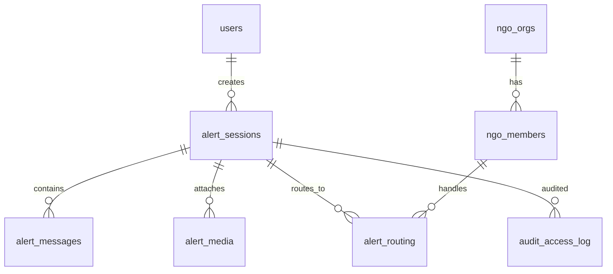

# NGEMBA — Schéma DB (brouillon Drizzle)

> Complément de [PLAN-MAITRE.md](./PLAN-MAITRE.md) · Phase 1 MVP

---

## 1. Diagramme entités



---

## 2. Tables

### `ng_users`

Compte citoyen léger (optionnel pour alerte anonyme).

| Colonne | Type | Notes |
|---------|------|-------|
| id | uuid PK | |
| phone | text unique nullable | E.164 |
| email | text unique nullable | |
| display_name | text nullable | |
| locale | text | `fr` default |
| discrete_alert_enabled | boolean | |
| discrete_trigger | jsonb | `{ type: "shake", count: 3 }` |
| created_at | timestamptz | |

### `alert_sessions`

Colonne vertébrale du produit.

| Colonne | Type | Notes |
|---------|------|-------|
| id | uuid PK | |
| status | enum | `opened\|active\|oriented\|closed\|cancelled` |
| source | enum | `sos_button\|shake\|witness\|chat\|school` |
| user_id | uuid FK nullable | null = anonyme |
| anonymous_token | text unique nullable | cookie éphémère |
| urgency | enum | `critical\|high\|medium\|low\|info` |
| category | text | `vbg\|accident\|fire\|...` |
| immediate_danger | boolean | |
| lat | decimal nullable | |
| lng | decimal nullable | |
| location_accuracy_m | int nullable | |
| location_consent_at | timestamptz nullable | |
| ai_summary | text nullable | |
| ai_confidence | decimal nullable | 0–1 |
| ai_payload | jsonb nullable | structured output brut |
| human_verified_at | timestamptz nullable | |
| operator_notes | text nullable | interne ONG |
| locale | text | langue du récit |
| created_at | timestamptz | |
| oriented_at | timestamptz nullable | |
| closed_at | timestamptz nullable | |

**Index :** `(status, urgency, created_at DESC)` · `(anonymous_token)` · `(user_id, created_at DESC)`

### `alert_messages`

| Colonne | Type | Notes |
|---------|------|-------|
| id | uuid PK | |
| session_id | uuid FK | |
| role | enum | `user\|ai\|operator\|system` |
| content | text | |
| metadata | jsonb nullable | tokens, model, etc. |
| created_at | timestamptz | |

### `alert_media`

| Colonne | Type | Notes |
|---------|------|-------|
| id | uuid PK | |
| session_id | uuid FK | |
| type | enum | `photo\|audio\|video\|document` |
| storage_key | text | R2 path chiffré |
| mime_type | text | |
| size_bytes | int | |
| ai_analysis | jsonb nullable | sans flag « preuve » |
| retention_until | timestamptz | |
| created_at | timestamptz | |

### `alert_routing`

| Colonne | Type | Notes |
|---------|------|-------|
| id | uuid PK | |
| session_id | uuid FK | |
| target_type | enum | `ngo\|service\|internal\|escalation` |
| target_id | uuid nullable | FK ngo_orgs etc. |
| status | enum | `pending\|assigned\|accepted\|completed\|failed` |
| assigned_to | uuid nullable | ngo_members |
| assigned_at | timestamptz nullable | |
| completed_at | timestamptz nullable | |
| outcome | text nullable | |

### `ngo_orgs`

| Colonne | Type | Notes |
|---------|------|-------|
| id | uuid PK | |
| name | text | |
| slug | text unique | |
| categories | text[] | `vbg\|medical\|...` |
| coverage_zones | jsonb nullable | communes |
| sla_minutes_critical | int | default 5 |
| active | boolean | |
| created_at | timestamptz | |

### `ngo_members`

| Colonne | Type | Notes |
|---------|------|-------|
| id | uuid PK | |
| org_id | uuid FK | |
| email | text unique | |
| password_hash | text | bcrypt |
| role | enum | `operator\|admin` |
| mfa_enabled | boolean | |
| last_login_at | timestamptz nullable | |

### `audit_access_log`

| Colonne | Type | Notes |
|---------|------|-------|
| id | uuid PK | |
| actor_type | enum | `user\|ngo_member\|system` |
| actor_id | uuid | |
| resource_type | text | `alert_session\|alert_media` |
| resource_id | uuid | |
| action | text | `view\|download\|assign\|close` |
| ip_hash | text nullable | |
| created_at | timestamptz | |

### `aggregated_incidents` (vue matérialisée)

Refresh cron — **aucune PII**.

| Colonne | Type | Notes |
|---------|------|-------|
| zone_key | text | commune ou grid cell |
| period | date | jour |
| category | text | |
| count | int | |
| urgency_max | enum | |

Règle k-anonymity : n'afficher que si `count >= 5`.

---

## 3. Enums TypeScript (extrait)

```typescript
export const alertStatus = ["opened", "active", "oriented", "closed", "cancelled"] as const;
export const urgencyLevel = ["critical", "high", "medium", "low", "info"] as const;
export const alertSource = ["sos_button", "shake", "witness", "chat", "school"] as const;
```

---

## 4. Migration Phase 1

Fichier suggéré : `services/ngemba/drizzle/0001_ngemba_core.sql`

Ordre :

1. Enums
2. `ng_users`, `ngo_orgs`, `ngo_members`
3. `alert_sessions`
4. `alert_messages`, `alert_media`, `alert_routing`
5. `audit_access_log`
6. Indexes
7. Vue `aggregated_incidents` (Phase 5 — stub vide OK)

---

## 5. Rétention & purge (cron)

| Table | Règle default |
|-------|---------------|
| `alert_media` | Supprimer S3 + row à `retention_until` |
| `alert_sessions` closed | Anonymiser PII à 24 mois |
| `alert_messages` | Cascade avec session |
| `audit_access_log` | Conserver 36 mois |
