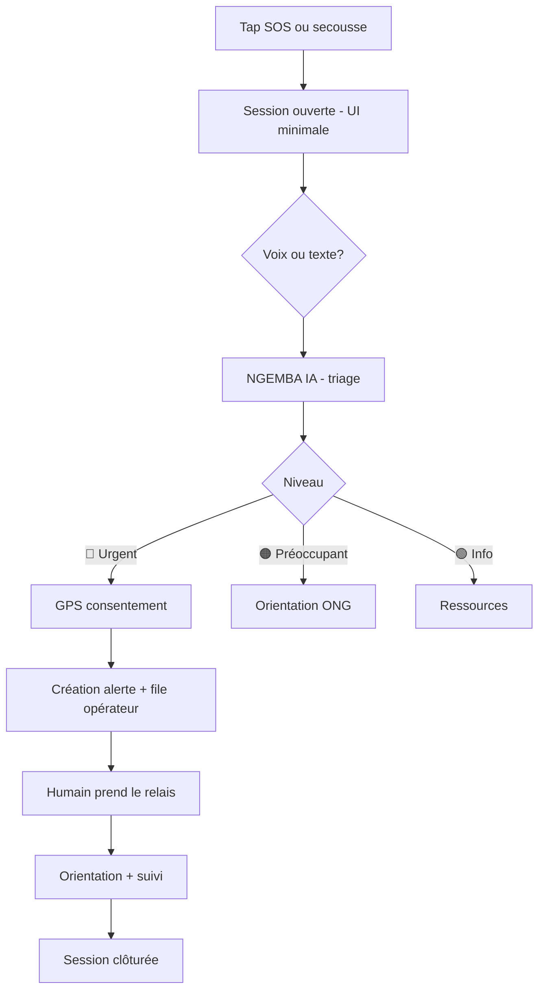

# NGEMBA - Plan maître

> **Plateforme intelligente de sécurité, protection et paix citoyenne** · RDC  
> Évolution de la vision **McBuleli Protect / McBuleli IA** vers une infrastructure de vigilance citoyenne.  
> **Philosophie :** ÉCOUTER → COMPRENDRE → ALERTER → ORIENTER → PROTÉGER → SUIVRE  
> **Règle fondamentale :** *« Une personne en danger ne devrait pas avoir à comprendre le système pour obtenir de l'aide. C'est le système qui doit comprendre la personne. »*

---

## 1. Positionnement produit

### 1.1 Qu'est-ce que NGEMBA ?

| Dimension | Description |
|-----------|-------------|
| **Nom** | **NGEMBA** - paix, sécurité, vigilance (lingala) |
| **Nature** | Couche citoyenne entre la population et les acteurs compétents |
| **Ce que NGEMBA n'est pas** | Remplacement de la police, des pompiers, des urgences médicales ou de la justice |
| **Ce que NGEMBA est** | Canal rapide pour **faire remonter**, **comprendre** et **orienter** une situation vers le bon intervenant |

### 1.2 Relation avec McBuleli

```
McBuleli P2P / Academy / Wallet     →  écosystème existant (fintech + formation)
NGEMBA                              →  produit distinct, domaine sensible, isolation technique
McBuleli IA (assistant produit)     →  patterns réutilisables (OpenAI, SSE, RAG) - prompts différents
```

**Décision d'architecture :** NGEMBA vit dans `services/ngemba/` (comme `services/immo-rdc/`), avec son propre schéma Postgres, ses clés API et sa politique de sécurité. Aucune FK vers `users` wallet/KYC sans consentement explicite.

### 1.3 Trois piliers fonctionnels

| Pilier | Verbe | Exemples |
|--------|-------|----------|
| **PROTÉGER** | Alerter | VBG, agression, enfant en danger, alerte discrète |
| **VIGILER** | Signaler | Accident, incendie, zone dangereuse, témoin |
| **PRÉVENIR** | Analyser | Cartographie agrégée, campagnes, McBuleli Jeunesse |

---

## 2. Principes non négociables

1. **Parcours minimal en urgence** - pas de formulaire à 15 questions ; objectif : *de la première alerte à l'orientation en quelques secondes*.
2. **GPS jamais obligatoire** - localisation ponctuelle liée à l'alerte, avec consentement explicite.
3. **IA = triage, pas verdict** - l'IA ne déclare jamais qu'un fichier est une « preuve authentifiée » ni qu'une personne est coupable.
4. **Humain dans la boucle** - urgence élevée → opérateur humain obligatoire avant action irreversible.
5. **Aucune fausse alerte ne bloque une future urgence** - restrictions progressives uniquement en cas d'abus répété et manifeste.
6. **Minimisation des données** - chiffrement, journalisation des accès, conservation limitée, séparation stats / données personnelles.
7. **Pas de carte des victimes** - cartographie uniquement **agrégée et anonymisée**.
8. **Témoin ≠ héros** - messages clairs pour signaler **sans se mettre en danger**.

---

## 3. Design system & inspiration UI

> Références : [Dribbble - SOS emergency](https://dribbble.com/search/sos-emergency) · [UX Case Study SOS Help](https://www.mahith.art/ux-case-study-sos-mobile-app) · [Women Safety App Figma case study](https://medium.com/@maryamasif1091/designing-a-women-safety-mobile-app-in-figma-a-ui-ux-case-study-c7a6a504ef5c)

### 3.1 Typographie

| Usage | Police | Poids |
|-------|--------|-------|
| Tout le produit | **Poppins** (déjà dans le monorepo McBuleli via `next/font`) | Regular 400 · Medium 500 · SemiBold 600 · Bold 700 |
| Chiffres / codes urgence | Poppins Tabular ou `font-variant-numeric: tabular-nums` | SemiBold |

**Règle stress :** corps minimum **16px**, boutons d'action minimum **48×48px** (WCAG touch target).

### 3.2 Palette NGEMBA

Couleur de base **vert profond** `#06402b` et secondaire **prune** `#882364`.

```css
/* services/ngemba/src/app/globals.css - tokens proposés */
:root {
  /* Primaire - vert NGEMBA */
  --ng-primary:        #06402b;
  --ng-primary-light:  #0a5c3e;
  --ng-primary-dark:   #042818;
  --ng-primary-muted:  #e6f2ec;
  --ng-primary-glow:   rgba(6, 64, 43, 0.22);

  /* Secondaire - prune */
  --ng-secondary:        #882364;
  --ng-secondary-light:  #a8327a;
  --ng-secondary-dark:   #5c1844;
  --ng-secondary-muted:  #f5eaf0;

  /* Urgence (sémantique - pas la marque) */
  --ng-urgent:    #c41e3a;   /* rouge alerte */
  --ng-warning:   #d97706;   /* orange situation préoccupante */
  --ng-calm:      #059669;   /* vert info / prévention */
  --ng-neutral:   #f4f6f5;   /* fond clair apaisant */

  /* Surfaces */
  --ng-bg:        #f8faf9;
  --ng-surface:   #ffffff;
  --ng-text:      #0c1a14;
  --ng-muted:     #5c6b63;
  --ng-border:    rgba(6, 64, 43, 0.12);
}
```

**Usage des couleurs :**

| Contexte | Couleur |
|----------|---------|
| Navigation, headers, confiance | Vert `#06402b` |
| CTA secondaires, ONG, féminin / VBG (avec parcimonie) | Prune `#882364` |
| Bouton SOS central | Rouge `#c41e3a` sur fond neutre clair - **toujours le même visuel** |
| Mode discret actif | Prune discret + vibration, pas de flash rouge |

### 3.3 Patterns UI (inspirés Dribbble / SOS apps)

#### Layout « Bento » accueil

Inspiré des apps SOS modernes : **bouton SOS circulaire central**, modules périphériques en grille.

```
┌─────────────────────────────────────┐
│  NGEMBA          🌐 FR  ·  🔒       │
├─────────────────────────────────────┤
│                                     │
│     ┌─────────┐   ┌─────────┐      │
│     │ Parler  │   │ Témoin  │      │
│     │  🎙️     │   │  👁️     │      │
│     └─────────┘   └─────────┘      │
│                                     │
│          ╭─────────────╮            │
│          │             │            │
│          │   🆘 SOS    │  ← 88px   │
│          │  En danger  │            │
│          │             │            │
│          ╰─────────────╯            │
│                                     │
│     ┌─────────┐   ┌─────────┐      │
│     │ Prévenir│   │ Ressources│    │
│     │  📚     │   │  ℹ️       │      │
│     └─────────┘   └─────────┘      │
│                                     │
│  [ Mode discret : OFF ●────○ ON ]  │
└─────────────────────────────────────┘
```

#### Règles d'interface en situation de stress

| Règle | Détail |
|-------|--------|
| **Un geste = une action** | SOS sans confirmation en urgence ; confirmation uniquement pour actions non urgentes |
| **Contraste élevé** | Texte `#0c1a14` sur fond `#f8faf9` ; mode sombre optionnel plus tard |
| **Peu de texte** | Icônes + labels courts ; voix prioritaire |
| **Feedback discret** | Vibration courte = alerte envoyée ; pas de son fort par défaut |
| **Session d'alerte** | Toute l'UI post-SOS suit un **cycle de session** unique (opened → active → oriented → closed) |
| **Progressive disclosure** | Photo / audio / vidéo proposés **après** création de l'alerte, jamais avant |

#### Écrans clés (inventaire MVP → V2)

| # | Écran | Priorité | Notes UI |
|---|-------|----------|----------|
| E0 | Splash + choix langue | P1 | FR - EN - LN - SW - LU - KG |
| E1 | Accueil Bento | P0 | SOS central rouge |
| E2 | « Je suis en danger » - racontez | P0 | Micro + texte ; placeholder empathique |
| E3 | Consentement GPS | P0 | Deux gros boutons : Partager / Continuer sans |
| E4 | Session alerte active | P0 | Statut, niveau urgence, ajouts optionnels |
| E5 | « Je suis témoin » | P1 | Bandeau « Ne vous mettez pas en danger » |
| E6 | Chat / voix NGEMBA IA | P1 | Bulles simples, gros bouton micro |
| E7 | Configuration alerte discrète | P2 | Secousse, combo boutons |
| E8 | Ressources & prévention | P2 | Cartes scrollables |
| E9 | Dashboard ONG | P1 | Liste alertes + fiche dossier |
| E10 | Carte agrégée (institution) | P3 | Heatmap zones, pas de pins individuels |

### 3.4 Composants réutilisables

```
<NgembaSosButton />      - 88px, pulse subtil, haptic
<NgembaUrgencyBadge />   - 🔴 🟠 🟢
<NgembaConsentGps />     - pattern réutilisable
<NgembaSessionBar />     - timer + statut session
<NgembaVoiceInput />     - Web Speech API + fallback
<NgembaMediaAttach />    - photo/audio/vidéo optionnels
<NgembaBentoGrid />      - layout accueil
```

---

## 4. Personas & parcours

### 4.1 Personas

| Persona | Besoin | Contrainte |
|---------|--------|------------|
| **Amina** - victime VBG | Alerter sans que l'agresseur le voie | Peut ne pas pouvoir parler/écrire |
| **Jean** - témoin | Signaler un accident | Ne veut pas s'approcher |
| **Prof. Mukendi** - école | Canal élève → référent | Mineurs, protocole légal |
| **Marie ONG** - opérateur | Dossier structuré rapidement | Surcharge, pas le temps de relire |
| **Autorité locale** | Tendances par zone | Pas de données nominatives |

### 4.2 Parcours critique - urgence (P0)



**Temps cible MVP :** ≤ 30 secondes de SOS à alerte créée (hors attente opérateur).

### 4.3 Parcours témoin (P1)

```
Accueil → Je suis témoin → Avertissement sécurité → Description (voix/texte)
→ GPS optionnel → IA classifie → Routage (santé / sécurité / infrastructure / ONG)
→ Accusé de réception discret
```

---

## 5. Moteur IA (NGEMBA IA)

### 5.1 Rôle de l'IA

| Fait par l'IA | Jamais par l'IA seule |
|---------------|----------------------|
| Comprendre le récit naturel | Décider qu'une victime ment |
| Classifier type + urgence | Transmettre à la police sans validation humaine |
| Extraire entités (lieu, heure, relation) | Certifier une preuve |
| Résumer pour l'ONG | Clôturer une urgence sans humain |
| Transcrire audio | Publier des données sur une carte publique |
| Suggérer questions manquantes | Remplacer un professionnel |

### 5.2 Pipeline technique

```
Entrée (texte | audio | image | vidéo)
    ↓
Normalisation locale (langue détectée)
    ↓
OpenAI - structured output (JSON schema)
    ↓
{
  "category": "vbg|accident|incendie|...",
  "urgency": "critical|high|medium|low|info",
  "immediate_danger": boolean,
  "summary_fr": "...",
  "missing_info": ["..."],
  "routing_hint": "ong_vbg|medical|...",
  "confidence": 0.0-1.0,
  "ai_disclaimer": "évaluation automatique - non vérifiée"
}
    ↓
Règles métier (seuils, escalade)
    ↓
File opérateur si urgency >= high
```

**Modèles suggérés :** `gpt-4o-mini` triage texte · `gpt-4o` multimodal si média · `whisper-1` transcription.

### 5.3 Garde-fous prompts

- System prompt séparé de McBuleli fintech (scope NGEMBA uniquement).
- Refus de conseils d'autodéfense violente ou confrontation.
- Distinction explicite dans chaque réponse : *« Ce que vous dites »* / *« Ce que le fichier semble montrer »* / *« Ce qui n'est pas vérifié »*.
- Journalisation des prompts/réponses chiffrée, rétention limitée (90 j par défaut).

---

## 6. Architecture technique

### 6.1 Stack proposée

| Couche | Choix | Justification |
|--------|-------|---------------|
| App | **Next.js 16** App Router + PWA | Aligné repo McBuleli, déploiement Render/VPS connu |
| Mobile | **PWA d'abord** | MVP rapide ; React Native Phase 3 pour secousse arrière-plan |
| ORM | **Drizzle** + Postgres | Cohérence monorepo |
| Auth citoyen | Compte léger (email/tél) + **mode anonyme alerte** | Réduire friction urgence |
| Auth ONG | JWT + rôles + MFA obligatoire | Données sensibles |
| Fichiers | **S3-compatible** (R2) chiffrés | Hors Postgres |
| Temps réel | **SSE** ou WebSocket (alertes ONG) | Pattern existant assistant McBuleli |
| IA | OpenAI API | Déjà intégré |
| Cartes | Mapbox ou Leaflet + tuiles OSM | Heatmap agrégée institution |
| i18n | FR + EN + Lingala + Swahili + Tshiluba + Kikongo | UI dès Phase 0 |

### 6.2 Schéma de dossiers

```
services/ngemba/
├── src/
│   ├── app/
│   │   ├── (citizen)/          # PWA citoyen
│   │   ├── (ngo)/              # Dashboard ONG
│   │   ├── (institution)/      # Analytics agrégées
│   │   └── api/
│   │       ├── alerts/
│   │       ├── ai/triage/
│   │       ├── media/
│   │       └── sessions/
│   ├── lib/
│   │   ├── ai/                 # prompts, schemas, guardrails
│   │   ├── alerts/             # lifecycle session
│   │   ├── routing/            # règles orientation
│   │   └── security/           # chiffrement, audit log
│   └── db/schema.ts
├── drizzle/
├── public/                     # PWA manifest NGEMBA
└── .env.example
```

### 6.3 Modèle de données (extrait)

```
alert_sessions
  id, status(open|active|oriented|closed), urgency, category
  user_id nullable, anonymous_token
  lat/lng nullable, location_consent_at
  ai_summary, ai_confidence, human_verified_at
  created_at, closed_at

alert_messages
  session_id, role(user|ai|operator|system), content, media_ref

alert_media
  id, session_id, type, storage_key, encrypted, retention_until

alert_routing
  session_id, target_type(ong|service|internal), target_id, status

operators / ngo_orgs / ngo_members
audit_access_log
aggregated_incidents (vue matérialisée - pas de PII)
```

### 6.4 Cycle de vie session (colonne vertébrale)

Inspiré des bonnes pratiques apps SOS : **toute feature** (GPS, média, notifications) est attachée à une `alert_session`.

```
opened → active → oriented → closed
         ↑ shake/SOS
         ↓ GPS, médias, IA, opérateur
```

Capteurs (GPS, micro, caméra) **actifs uniquement** pendant `active`, arrêt automatique à `closed`.

---

## 7. Sécurité & conformité

| Mesure | Implémentation |
|--------|----------------|
| Chiffrement transit | TLS 1.3 partout |
| Chiffrement repos | Postgres + colonnes sensibles · S3 SSE |
| Accès ONG | RBAC · MFA · IP allowlist optionnelle |
| Audit | `audit_access_log` - qui a vu quel dossier, quand |
| Consentement | Écrans explicites · preuve horodatée |
| Rétention | Alertes : 24 mois max par défaut · médias : 12 mois · configurable par partenaire |
| Anonymat | Token éphémère pour alertes sans compte |
| Stats | Table agrégée sans `user_id` |

**Phase 0 obligatoire :** revue juridique RDC (protection des données, mineurs, preuves numériques, responsabilité plateforme).

---

## 8. Rôles & dashboards

### 8.1 Matrice des rôles

| Rôle | Accès |
|------|-------|
| **Citoyen** | SOS, témoin, prévention, ses propres alertes |
| **Opérateur ONG** | File alertes assignées, dossiers, notes internes |
| **Admin ONG** | Équipe, stats org, protocoles |
| **Référent école** | McBuleli Safe School - signalements élèves |
| **Analyste institution** | Cartes agrégées, exports anonymisés |
| **Super admin NGEMBA** | Config routing, modération abus, audit |

### 8.2 Dashboard ONG (wireframe textuel)

```
┌─ NGEMBA ONG ─────────────────────────────────────┐
│ 🔴 3 urgentes   🟠 7 en attente   🟢 12 info      │
├────────────────────────────────────────────────────┤
│ Filtres: Urgence · Type · Zone · Non assignées     │
├────────────────────────────────────────────────────┤
│ #1847  VBG · URGENT · Gombe · il y a 2 min         │
│        IA: menace immédiate · GPS ✓ · audio ✓      │
│        [Prendre] [Assigner]                        │
├────────────────────────────────────────────────────┤
│ Fiche dossier                                      │
│ Résumé IA (modifiable par opérateur)               │
│ Timeline messages · Médias (accès journalisé)      │
│ Actions: Orienter · Appeler · Clôturer · Escalader │
└────────────────────────────────────────────────────┘
```

---

## 9. Modules produit (roadmap fonctionnelle)

### 9.1 McBuleli Safe School (Phase 4)

- Signalement élève : harcèlement, violence, abus, cyber.
- Identité protégée · référent établissement · protocole mineur.
- Pas de mélange avec dossiers citoyens adultes sans garde-fous.

### 9.2 McBuleli Jeunesse (Phase 4)

- Scénarios interactifs IA : consentement, cyberharcèlement, corruption.
- Gamification légère · pas de classement public.

### 9.3 Observatoire citoyen (Phase 5)

- Heatmap par commune / quartier (agrégé ≥ k-anonymity, ex. ≥ 5 signalements).
- Exports pour ONG et planification urbaine (éclairage, signalisation).

---

## 10. Plan de réalisation par phases

> Estimations pour une **petite équipe** (2 dev + 1 design + 1 domaine/partenaires), en parallèle d'autres produits McBuleli.

### Phase 0 - Fondations (4-6 semaines)

| Livrable | Détail |
|----------|--------|
| Décision go/no-go | Partenaire ONG pilote signé (ex. centre VBG Kinshasa) |
| Juridique | Note responsabilité + politique confidentialité + mineurs |
| Design | Figma : E0-E5 + design tokens NGEMBA |
| Technique | Repo `services/ngemba/`, CI, `.env.example`, schéma DB v0 |
| Protocole opérateur | Script prise d'appel, escalade, fausses alertes |

**Critère de sortie :** 1 ONG pilote + maquettes validées + schéma DB migré en staging.

---

### Phase 1 - MVP « Protéger » (8-10 semaines)

**Objectif :** une personne en danger peut alerter et être orientée par un humain ONG.

| Feature | Inclus |
|---------|--------|
| PWA accueil Bento + bouton SOS | ✅ |
| Saisie texte + micro (Web Speech) | ✅ |
| Triage IA → 3 niveaux urgence | ✅ |
| Consentement GPS ponctuel | ✅ |
| Création session + file ONG | ✅ |
| Dashboard ONG minimal (liste + fiche) | ✅ |
| Notifications opérateur (email + SSE) | ✅ |
| 6 langues UI (FR EN LN SW LU KG) | ✅ |

| Exclu MVP | Reporté |
|-----------|---------|
| Alerte discrète / secousse | Phase 3 |
| Photo / vidéo | Phase 2 |
| Carte institution | Phase 5 |
| Intégration police directe | Hors scope jusqu'à accord institutionnel |

**KPI Phase 1 :**

- Temps médian SOS → alerte créée : **< 30 s**
- 100 % urgences `critical` vues par opérateur **< 5 min** (heures ouvrées pilote)
- Satisfaction pilote ONG ≥ 4/5

---

### Phase 2 - Médias & témoin (6-8 semaines)

| Feature | Détail |
|---------|--------|
| Upload photo / audio / vidéo | Chiffré, lié session |
| Transcription Whisper + analyse | Sans certification « preuve » |
| Parcours « Je suis témoin » | E5 |
| Swahili UI | ✅ |
| Compte citoyen optionnel | Historique alertes |

---

### Phase 3 - Alerte discrète & mobile natif (8-12 semaines)

| Feature | Détail |
|---------|--------|
| App React Native (ou Expo) | Secousse, arrière-plan limité iOS/Android |
| Mode discret | Vibration, pas d'écran flashy |
| Combinaisons boutons configurables | Alternative secousse |
| Widget / raccourci écran verrou | Si OS le permet |

**Contrainte réaliste :** iOS limite fortement le background - documenter clairement ce qui est possible par plateforme.

---

### Phase 4 - École & Jeunesse (10-14 semaines)

- Safe School module + référents.
- Jeunesse : 10 scénarios IA initiaux.
- Contenu pédagogique enrichi dans les 6 langues.

---

### Phase 5 - Ville & institutions (12+ semaines)

- Dashboard institution · heatmap agrégée.
- API export anonymisé.
- Partenariats municipalité (pilote 1 commune Kinshasa).

---

## 11. Routing & partenaires (RDC)

### 11.1 Matrice d'orientation initiale (configurable)

| Catégorie IA | Canal MVP | Canal cible |
|--------------|-----------|-------------|
| VBG / agression sexuelle | ONG pilote | Réseau centres |
| Enfant en danger | ONG + protocole | UNICEF / autorité protection enfant |
| Accident / urgence médicale | Info + numéros | SAMU / pompiers (signalement citoyen, pas dispatch auto) |
| Incendie | Info + numéros | Pompiers |
| Infrastructure / éclairage | Ticket agrégé | Mairie / REGIDESO |
| Cybermenace | ONG + ressources | CERT / police cyber (phase ultérieure) |

**Important MVP :** NGEMBA **informe et oriente** ; le dispatch vers services d'urgence reste manuel ou par partenariat institutionnel explicite.

### 11.2 Partenaires à activer (Phase 0)

| Type | Action |
|------|--------|
| ONG VBG Kinshasa | Pilote opérateur 24/7 limité |
| École partenaire | Intention Safe School |
| Avocat / conseil juridique | Cadre responsabilité |
| Hébergeur | VPS Render + Postgres + R2 (pattern McBuleli) |

---

## 12. Risques & mitigations

| Risque | Impact | Mitigation |
|--------|--------|------------|
| Abus / fausses alertes | Surcharge ONG | File + humain + restrictions progressives |
| Fuite de données | Catastrophique | Isolation service, chiffrement, audit |
| Dépendance OpenAI | Coût / offline | Fallback règles keyword + cache |
| Attente opérateur | Victime abandonnée | SLA affiché · numéros secours toujours visibles |
| Stigmatisation VBG | Re-victimisation | UX neutre · anonymat · pas de labels visibles |
| Réglementation | Blocage légal | Phase 0 juridique |
| Connectivité faible | Alertes perdues | Queue offline PWA (sync à reconnexion) |

---

## 13. Métriques produit

| Métrique | Cible MVP |
|----------|-----------|
| TTFAlert (SOS → alerte DB) | p50 < 30 s |
| TTFHuman (urgent → opérateur) | p90 < 5 min (heures pilote) |
| Taux orientation réussie | > 80 % |
| Précision triage IA (audit humain) | > 75 % category + urgency |
| NPS opérateurs ONG | > 40 |
| Taux consentement GPS | Mesurer, ne pas forcer |

---

## 14. Stack de livrables design (prochaine action)

1. **Figma NGEMBA** - appliquer tokens §3.2, écrans E0-E5.
2. **Prototype clic** - parcours SOS complet (< 5 écrans).
3. **Design review** - tester avec 5 personnes (dont 2 profils stress simulé).
4. **Export composants** - alignés Tailwind v4 dans `services/ngemba/`.

Références visuelles à consulter sur [Dribbble SOS emergency](https://dribbble.com/search/sos-emergency) :

- Bouton SOS circulaire central, fond clair apaisant
- Grille Bento modules secondaires
- Écrans « silent alert » discrets (couleurs neutres, pas de rouge)
- Cartes onboarding minimalistes
- Dashboard ops sombre/clair avec badges urgence

---

## 15. Décisions (Phase 0)

| # | Question | Décision |
|---|----------|----------|
| D1 | Domaine | **`ngemba-rdc.org`** (temporaire) - domaine propre plus tard |
| D1b | VPS | **`153.75.235.176`** (Cyber Alert + Africa Insight + Patty) - voir [PHASE0-AUDIT.md](./PHASE0-AUDIT.md) |
| D2 | Compte obligatoire ? | Non pour SOS · oui pour historique *(à confirmer)* |
| D3 | Hébergement données | Même VPS CyberAlert · DB `ngemba` isolée · R2 sous `media.cyberalert-rdc.org` |
| D4 | Opérateurs | ONG seule vs call center McBuleli *(ouvert)* |
| D5 | Monétisation | Gratuit citoyen · institution / ONG abonnement *(ouvert)* |

---

## 16. Synthèse exécutable

**NGEMBA** transforme la vision McBuleli Protect en **infrastructure de sécurité citoyenne** en trois temps :

1. **Maintenant (Phase 0-1)** - PWA SOS + IA + humain ONG : prouver la valeur en **30 secondes**.
2. **Ensuite (Phase 2-3)** - Médias, témoin, alerte discrète : couvrir plus de situations réelles.
3. **Plus tard (Phase 4-5)** - École, jeunesse, ville : prévention à l'échelle.

Le succès ne se mesure pas au nombre de fonctionnalités, mais au temps gagné entre **« j'ai peur »** et **« quelqu'un m'aide »**.

---

## Annexes

- [PHASE0-AUDIT.md](./PHASE0-AUDIT.md) - audit VPS + domaine `ngemba-rdc.org`
- [01-DESIGN-TOKENS.md](./01-DESIGN-TOKENS.md) - palette, typo, composants Tailwind
- [02-SCHEMA-DB-DRAFT.md](./02-SCHEMA-DB-DRAFT.md) - tables Drizzle proposées
- [03-PROMPTS-IA-DRAFT.md](./03-PROMPTS-IA-DRAFT.md) - system prompts & JSON schema triage
- [04-NOTE-JURIDIQUE-BROUILLON.md](./04-NOTE-JURIDIQUE-BROUILLON.md) - cadre responsabilité (brouillon)
- [05-PROTOCOLE-OPERATEUR.md](./05-PROTOCOLE-OPERATEUR.md) - script ONG pilote
- [06-PLAN-COMBINE-OPENAI.md](./06-PLAN-COMBINE-OPENAI.md) - plan McBuleli + OpenAI
- [07-COUTS-OPENAI-GPS.md](./07-COUTS-OPENAI-GPS.md) - GPS vs OpenAI - modes de cout

*Document v1.2 - 2 sept. 2026 - McBuleli / NGEMBA*
