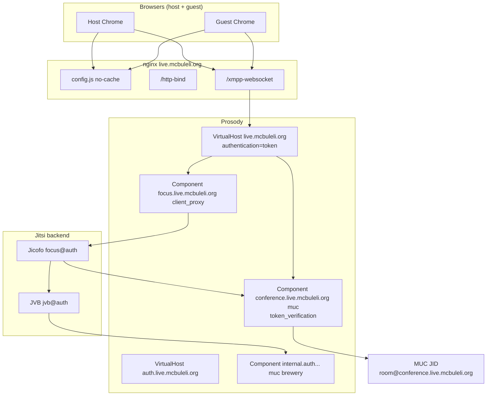

# McBuleli Live — MUC Unification Report

**Domain:** `live.mcbuleli.org`  
**Target room JID:** `test-live-mcbuleli@conference.live.mcbuleli.org`  
**Stack:** Prosody + Jicofo + JVB + nginx + JWT (McBuleli app)

---

## Executive summary

Users joining the same room name were isolated because **multiple independent XMPP trees** could be created for the same browser URL. The server allowed (and sometimes actively configured) **guest domain routing**, **lobby separation**, and **conflicting config.js overrides** — so host and guest authenticated successfully but landed in **different MUC JIDs**.

**Fix:** Single-tenant JWT-only model — all participants authenticate on `live.mcbuleli.org` and join **one** MUC component: `conference.live.mcbuleli.org`.

---

## Root causes (ordered by impact)

### 1. Guest domain split (`anonymousdomain`) — PRIMARY

| Layer | Bad state | Effect |
|-------|-----------|--------|
| `config.js` | `anonymousdomain: 'guest.live.mcbuleli.org'` | Guests use guest XMPP domain |
| Prosody | `VirtualHost "guest.live.mcbuleli.org"` active | Separate MUC tree: `conference.guest.live...` |
| Script | `fix-prosody-jwt-guest.sh` (deprecated) | Re-enabled guest split |

**Symptom:** Same URL `/test-live-mcbuleli`, each user sees **1 participant** (TH alone).

**Fix:** `delete config.hosts.anonymousdomain`, comment guest vhost, `enable_domain_verification = false` on main vhost only.

### 2. Lobby Prosody component

| Layer | Bad state | Effect |
|-------|-----------|--------|
| Prosody | `muc_lobby_rooms` + `lobby.live.mcbuleli.org` | `moderator: false` → lobby, not main MUC |
| config.js | `enableLobby: true` | Client waits in lobby |

**Fix:** Lobby vhost commented, `enableLobby = false`, JWT `lobby_bypass: true` (Render).

### 3. config.js sprawl (conflicting `mcbuleli-*` blocks)

Multiple scripts appended overrides (`mcbuleli-jwt-guest`, `mcbuleli-no-guest`, etc.). **Last line wins** in JS — unpredictable effective config + browser cache.

**Fix:** Purge all `mcbuleli-*` blocks → single `mcbuleli-live-baseline` marker.

### 4. nginx duplicate `/http-bind`

Duplicate `location /http-bind` → **502 / broken XMPP** → auth ping-only, no MUC join.

**Fix:** `fix-nginx-xmpp-dedupe.sh` + single `mcbuleli-xmpp-proxy.conf` snippet.

### 5. Client ping-only (post-disco, pre-MUC)

XMPP auth OK, ping OK, **zero presence** to `conference.live.mcbuleli.org`:
- `prejoinPageEnabled: true` (user must click Join)
- URL hash `SyntaxError` (e.g. `config.hosts.focus=focus.live...` without JSON quotes)
- Tab hibernating / capture interrupted

**Fix:** `fix-config-force-join.sh`, valid hash in app (`jitsiHashParam`), `fix-ping-only.sh`.

### 6. Jicofo focus / conference allocation

`focus@auth` disconnected or multiple zombie sessions → `service-unavailable` on conference IQ.

**Fix:** `fix-focus-service-unavailable.sh`, `fix-jicofo-jvm-xml-limits.sh`, `fix-jicofo-zombie.sh`.

---

## Target architecture



---

## Critical mappings (must match everywhere)

| Setting | Value |
|---------|-------|
| `config.hosts.domain` | `live.mcbuleli.org` |
| `config.hosts.muc` | `conference.live.mcbuleli.org` |
| `config.hosts.focus` | `focus.live.mcbuleli.org` |
| `config.hosts.anonymousdomain` | **deleted** |
| `config.bosh` | `https://live.mcbuleli.org/http-bind` |
| `config.websocket` | `wss://live.mcbuleli.org/xmpp-websocket` |
| Prosody main vhost | `authentication = "token"` |
| Prosody guest/lobby | **commented out** |
| Jicofo `conference-muc-jid` | `conference.live.mcbuleli.org` |
| Jicofo `client-proxy` | `focus.live.mcbuleli.org` |
| JWT `sub` | `live.mcbuleli.org` |
| JWT `room` | same slug for host and guest |

---

## Files modified (repo)

| File | Change |
|------|--------|
| `ops/jitsi/fix-live-master.sh` | **NEW** — master audit + fix orchestrator |
| `ops/jitsi/audit-muc-fragmentation.sh` | **NEW** — deep stack audit for split MUC |
| `ops/jitsi/fix-live-unified-baseline.sh` | Added `hosts.focus`, https bosh, prejoin off, nginx dedupe |
| `ops/jitsi/deploy-live-vps.sh` | Calls `fix-live-master.sh` instead of guest JWT path |
| `ops/jitsi/fix-ping-only.sh` | Ping-only client blocker workflow |
| `ops/jitsi/capture-muc-join.sh` | Enhanced verdicts + prejoin check |
| `src/lib/academy-jitsi-token.ts` | `jitsiHashParam()` — valid JSON hash |
| `src/lib/academy-live.ts` | No `hosts.*` in URL hash |

## Files modified on VPS (by scripts)

| Path | Action |
|------|--------|
| `/etc/jitsi/meet/live.mcbuleli.org-config.js` | Single baseline block, no anonymousdomain |
| `/etc/prosody/conf.d/live.mcbuleli.org.cfg.lua` | JWT-only, guest/lobby off, token_verification on MUC |
| `/etc/prosody/conf.avail/live.mcbuleli.org.cfg.lua` | Synced with conf.d |
| `/etc/nginx/snippets/mcbuleli-xmpp-proxy.conf` | BOSH + websocket proxy |
| `/etc/nginx/sites-enabled/live.mcbuleli.org*` | Deduped http-bind, config.js no-cache |
| `/etc/jitsi/jicofo/jicofo.conf` | conference-muc-jid, client-proxy, brewery |
| `/etc/jitsi/jicofo/config` | JVM XML limits, localhost XMPP |
| `/root/nginx-backups/` | Timestamped backups before each fix |

---

## Commands to run on VPS

```bash
cd ~/McBuleliP2P && git pull

# 1. Master fix (audit → backup → patch → restart → verify)
sudo bash ops/jitsi/fix-live-master.sh test-live-mcbuleli

# 2. Deep audit (must PASS)
sudo bash ops/jitsi/audit-muc-fragmentation.sh test-live-mcbuleli

# 3. Live validation (2 users, during join)
sudo bash ops/jitsi/capture-muc-join.sh test-live-mcbuleli
sudo bash ops/jitsi/check-muc-live.sh test-live-mcbuleli
```

**SUCCESS criteria:**
- `target_FOUND`
- `occupant_count=2`
- Same JID `test-live-mcbuleli@conference.live.mcbuleli.org`
- No `SPLIT_HOST` in MUC report
- No `Authenticated.*@guest.` in prosody.log

---

## Render (app side)

Ensure deployed:
- `JITSI_APP_ID=mcbuleli_live`
- `JITSI_JWT_SUB=live.mcbuleli.org`
- `JITSI_JWT_SECRET` = `/root/.mcbuleli-jitsi-secret` on VPS
- `academy-jitsi-token.ts`: `lobby_bypass: true`, `kid` header, valid hash via `jitsiHashParam`

---

## Preventive recommendations

1. **Never run** `fix-prosody-jwt-guest.sh` — it exits with error; do not bypass.
2. **Single entry point:** `fix-live-master.sh` for any MUC/split issue.
3. **After branding:** always re-run `fix-config-force-join.sh` (deploy script does this).
4. **Verify served config:** `verify-config-served.sh` — not just on-disk config.js.
5. **Monitor split:** `grep SPLIT_HOST /tmp/mcb-muc-report-*.txt` during live sessions.
6. **Browser test isolation:** `gen-live-join-url.sh` bypasses app to separate server vs client bugs.
7. **Do not stack** `mcbuleli-*` patches manually — use baseline marker only.

---

## What is NOT the cause

- `muc_domain_mapper` in Prosody logs (standard module)
- `No stream features on insecure session` on port 5222 (bots/scans)
- Jigasi `kid claim missing` (parasite host — purge via jaas disable)

See also: `ops/jitsi/SPLIT-ROOM-ROOT-CAUSE.md`
